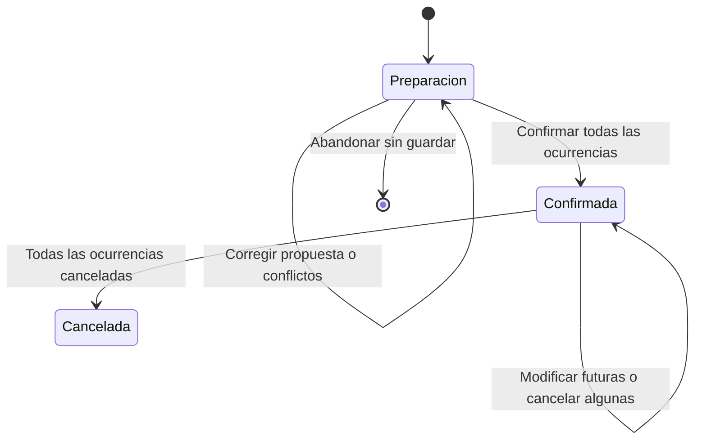

# Ciclo de reservas

**Versión:** 1.0 final, aprobada. Alcance vigente definido en la [especificación general](00-especificacion.md).

Estado: acuerdos DA-19 a DA-28 y reglas previas. Se conservan las entidades Reserva, ReservaEsporádica, ReservaPeriódica y DetalleReserva de los diagramas. Los acuerdos finales DA-83/84 se incorporan en las reglas de edición.

## Preparación y confirmación

Bedel o Administrador prepara la propuesta, consulta disponibilidad y selecciona las aulas por ocurrencia. Esta preparación es temporal: no ocupa espacios, no se guarda como borrador y no requiere aprobación de otro actor (DA-19).

Antes de confirmar se presenta el resumen y se revalidan fechas, calendario, aulas, duración y solapamientos. La consulta inicial no garantiza que el aula siga libre. Si hay conflicto, se muestran las fechas afectadas y se conserva la propuesta en el flujo actual para corregirla (DA-20). No se promete recuperar la preparación después de abandonar la pantalla o cerrar la sesión.

La confirmación guarda la reserva y todas las ocurrencias seleccionadas o no guarda ninguna. Un fallo de persistencia tampoco deja resultados parciales (CU-23, RNF-02). No se omiten automáticamente fechas conflictivas para guardar el resto.

DA-33 concreta la notificación de RF-23 como mensaje en pantalla al operador después de guardar; no se envían emails. Ver [consultas y comunicaciones](08-consultas-y-comunicaciones.md).

## Horarios y selección de aulas (DA-24 a DA-28)

### Horarios por día de semana

Una reserva periódica permite indicar un inicio y una duración para cada día de semana seleccionado. Por ejemplo, lunes de 08:00 a 10:00 y miércoles de 10:00 a 12:00. Cada fecha generada recibe el horario correspondiente a su día, siempre dentro de los módulos y horario institucional acordados.

Esto no agrega múltiples turnos independientes dentro de un mismo día de semana: ese comportamiento no fue solicitado. La selección de días y sus horarios es parte de la preparación; el detalle conserva la fecha, inicio y cantidad de módulos como en los modelos originales.

### Sugerencias y selección por fecha

Para cada ocurrencia, buscar aulas que cumplan tipo, capacidad suficiente para la cantidad de alumnos prevista, características requeridas, estado reservable y ausencia de solapamientos. La cantidad de PC no es filtro, requisito ni criterio de ordenamiento (DA-30). Mostrar hasta tres por capacidad ascendente y, a igual capacidad, por identificador ascendente. Si hay una o dos, mostrar esas; si hay más, ofrecer acceso a las demás aulas válidas. No completar sugerencias con aulas insuficientes u ocupadas.

Bedel o Admin puede seleccionar un aula para una fecha o aplicar un aula a todas las ocurrencias de un día de semana donde esté disponible. Cada fecha se valida individualmente. Las restantes se muestran pendientes de resolver; no se les asigna otra aula automáticamente ni se ocultan.

### Cuando no hay disponibilidad

Mostrar, para esa fecha y horario, las aulas que satisfacen los criterios del pedido pero están ocupadas, ordenadas por menor cantidad de minutos de superposición. Mostrar las reservas conflictivas que permiten identificar el problema. Una opción de este listado no es un aula disponible y no puede confirmarse mientras el conflicto siga existiendo.

Los minutos se calculan únicamente dentro del intervalo solicitado y sobre reservas vigentes; no se cuenta tiempo ocupado fuera de ese intervalo. Por ejemplo, para 09:00–11:00, una ocupación 08:00–09:30 aporta 30 minutos de conflicto; una 10:00–11:00 aporta 60. Se cuenta el tiempo efectivamente superpuesto, sin duplicar minutos si coincidieran intervalos de conflicto. Para empates se aplica como convención de presentación capacidad y luego identificador, conservando el criterio principal acordado.

Si ninguna aula cumple capacidad, tipo y características, informar falta de aulas compatibles; no mostrar como solución un espacio insuficiente o de otro tipo.

### Exclusión explícita y resumen final

Antes de confirmar se pueden excluir fechas y revisar cuáles quedaron fuera (DA-27). Las exclusiones elegidas por el usuario se distinguen de las omisiones del calendario, como feriados, receso o fechas ya iniciadas.

Una fecha excluida no genera DetalleReserva y no es una ocurrencia cancelada. El resumen de preparación permite verificar esa diferencia sin agregar un historial persistente de borradores. En series confirmadas, DA-58 exige conservar la fecha como exclusión para futuras actualizaciones de calendario. Toda fecha incluida debe tener un aula válida asignada; si se excluyen todas, no se confirma una reserva vacía.

La atomicidad se aplica al conjunto final: si el usuario excluyó una de diez fechas, se confirman las nueve elegidas o ninguna. Si aparece un conflicto nuevo al confirmar, no se excluye automáticamente: se vuelve a corrección conservando la propuesta (DA-20).

## Estados

| Elemento | Estado | Significado |
|---|---|---|
| Preparación | PENDIENTE, solo conceptual | Propuesta temporal sin persistencia ni ocupación. |
| Ocurrencia | CONFIRMADA | Asignación registrada no cancelada. Puede ser futura, estar en curso o haber terminado. |
| Ocurrencia | CANCELADA | Asignación cancelada con motivo, que no bloquea disponibilidad. Se conserva como histórico. |
| Reserva | CONFIRMADA | Existe al menos una ocurrencia no cancelada, aunque todas las restantes sean pasadas. |
| Reserva | CANCELADA | Todas sus ocurrencias están canceladas. |

El momento de inicio y fin permite distinguir futuro, en curso y pasado sin agregar estados persistentes para esas condiciones. «CONFIRMADA» no equivale a asistencia real ni garantiza que la clase se haya dictado.

El diagrama resume la cabecera. DA-49 excluye reactivación de canceladas; se registra otra reserva si vuelve a necesitarse una clase.

## Modificar y cancelar

Bedel y Administrador pueden elegir una fecha, varias fechas o todas las futuras. Una ocurrencia es futura si su inicio es estrictamente posterior al momento actual de la institución. Una ocurrencia que ya comenzó queda protegida, aunque no haya finalizado (DA-21).

Las modificaciones revalidan las reglas aplicables y los solapamientos antes de guardar. Las cancelaciones exigen motivo y actualizan el estado de las ocurrencias seleccionadas; el motivo queda en cada detalle afectado. El aula liberada puede volver a asignarse para ese intervalo.

La cabecera refleja el conjunto de detalles conforme a DA-22. Por ejemplo: una reserva con una clase pasada no cancelada y tres futuras canceladas permanece CONFIRMADA, pero ya no tiene clases futuras vigentes. No se agrega un estado de finalización ni de cancelación parcial por ese caso.

No se borran las ocurrencias canceladas. La trazabilidad de modificaciones y cancelaciones conserva el usuario actuante, momento y entidad exigidos por los requisitos originales.

## Datos compartidos e historial (DA-47)

Docente, curso/comisión, cantidad de alumnos prevista, tipo de aula y equipamiento solicitado pertenecen a la cabecera y se aplican a sus ocurrencias. Pueden editarse mientras ninguna ocurrencia haya comenzado, revalidando que las aulas asignadas sigan cumpliendo los requisitos. El cambio de cabecera afecta a la reserva completa, no solo a una fecha seleccionada.

Una vez iniciada la serie, esos datos quedan fijos. Si cambia el docente, grupo, cantidad prevista o requisitos de aula, se cancelan las fechas futuras afectadas y se registra una nueva reserva con los datos nuevos. Las fechas pasadas conservan sus datos y su contribución a las métricas. No se agrega versionado de la cabecera ni valores distintos de alumnos por ocurrencia.

Esta restricción no impide reprogramar aula, fecha u horario de las ocurrencias futuras conforme a DA-21. Las cancelaciones exigen motivo y las nuevas reservas vuelven a validar disponibilidad.

## Concurrencia de edición (DA-50)

Si otro usuario modifica o cancela la reserva después de que el operador la abrió, impedir guardar sobre esa versión desactualizada. Informar el cambio y exigir revisar la versión actual antes de volver a confirmar. No aplicar silenciosamente ni mezclar cambios de ambos usuarios.

Además, revalidar al guardar que las ocurrencias elegidas todavía sean futuras. La validación al abrir la pantalla no basta si una clase comienza durante la edición. El documento 15 define control de versiones y coordinación transaccional para detectar cambios concurrentes; la implementación debe respetar ese contrato.

## Canceladas (DA-49)

Una ocurrencia cancelada conserva su estado e historial y no se puede reactivar ni editar para volverla vigente. Una nueva necesidad se registra como otra reserva, sujeta a todas las validaciones actuales. Esto se aplica también cuando toda la cabecera está cancelada.

## Reservar con un período ya iniciado

Las fechas candidatas se derivan de los días de semana elegidos dentro del cuatrimestre o de la unión de ambos cuatrimestres para una reserva anual. Se excluyen el receso y los feriados, y solo se generan ocurrencias cuyo inicio aún no llegó (DA-16/23).

La preparación informa las fechas omitidas, incluyendo las ya iniciadas. Si no queda ninguna válida, no se puede confirmar una reserva vacía. El momento de inicio debe volver a verificarse al confirmar, porque puede haber transcurrido durante la preparación.

## Cambios al modelo original

| Elemento | Ajuste acordado | Motivo |
|---|---|---|
| EstadoReserva.PENDIENTE | Solo representa preparación temporal; no se persiste. | DA-19, sin introducir borradores o aprobaciones. |
| DetalleReserva | Agregar estado y motivo de cancelación. | DA-21/22 y cancelación por fecha de RF-25. |
| Reserva.estado | Mantener consistencia con los estados de sus detalles. | DA-22. |
| Historial | Conservar cancelaciones y trazabilidad; proteger ocurrencias iniciadas. | DA-21/22 y RNF-04. |

El campo motivoCancelacion original de la cabecera no puede ser la única fuente de motivos de fechas distintas. Su eliminación o función residual se precisará al consolidar el modelo; los motivos de cancelación por ocurrencia son obligatorios.

## Criterios de aceptación

| ID | Situación | Resultado esperado |
|---|---|---|
| CA-R01 | Se prepara una reserva y se abandona sin confirmar. | No existe una reserva guardada ni se bloquea el aula. |
| CA-R02 | Una de tres aulas/fechas seleccionadas ya está ocupada al confirmar. | No se guarda ninguna de las tres ocurrencias; se identifica el conflicto y se conserva la propuesta para corregir. |
| CA-R03 | Falla la persistencia de una confirmación. | No queda cabecera ni detalles parcialmente registrados. |
| CA-R04 | Se cancela una de tres ocurrencias futuras con motivo. | Solo esa fecha queda CANCELADA y libera el aula; las otras dos siguen vigentes y la cabecera CONFIRMADA. |
| CA-R05 | Se cancelan todas las ocurrencias de una reserva que aún no comenzó. | Todos los detalles y la cabecera quedan CANCELADOS, conservando historial. |
| CA-R06 | Se cancelan todas las futuras de una reserva con una clase pasada no cancelada. | Las futuras se cancelan; la pasada se conserva; cabecera CONFIRMADA sin próximas clases vigentes. |
| CA-R07 | Se intenta modificar o cancelar una ocurrencia que ya empezó. | No se modifica esa ocurrencia. |
| CA-R08 | Se cancela sin motivo. | La cancelación no se registra y se solicita motivo. |
| CA-R09 | Se registra una recurrencia a mitad del período. | Solo se generan ocurrencias de inicio futuro; se muestran las omitidas. |
| CA-R10 | El período terminó o no deja ninguna ocurrencia válida. | No se confirma una reserva sin detalles. |
| CA-R11 | Se elige lunes 08–10 y miércoles 10–12. | Cada ocurrencia generada recibe el horario de su día de semana. |
| CA-R12 | Se aplica un aula a cinco lunes y solo está libre en cuatro. | Se aplica a los cuatro compatibles y se muestra el lunes restante pendiente, sin sobre-reservarlo ni descartarlo. |
| CA-R13 | Hay dos aulas disponibles que cumplen los criterios. | Se muestran dos sugerencias válidas, sin completar con aulas ocupadas. |
| CA-R14 | Hay cinco aulas válidas. | Se sugieren las tres primeras por capacidad e identificador; se permite elegir otra de las restantes. |
| CA-R15 | No hay aulas libres; dos aulas compatibles tienen 30 y 60 minutos de conflicto. | Se muestra primero la de 30, ambas identificadas como ocupadas y con sus conflictos. No pueden confirmarse sin resolverlos. |
| CA-R16 | Se excluye explícitamente una de diez fechas antes de confirmar. | El resumen identifica la excluida; solo las nueve incluidas integran la confirmación atómica. |
| CA-R17 | Tras excluir fechas, no queda ninguna incluida. | No se confirma una reserva vacía. |
| CA-R18 | No existe aula de capacidad suficiente. | Se informa falta de aulas compatibles, sin sugerir aulas insuficientes como disponibles. |

## Criterios adicionales de edición

| ID | Situación | Resultado esperado |
|---|---|---|
| CA-R19 | Cambiar cantidad de alumnos antes de iniciar la serie. | Se revalidan las aulas; no guardar si alguna queda con capacidad insuficiente. |
| CA-R20 | Cambiar docente, curso/comisión o alumnos después de iniciada la serie. | Impedir cambio de cabecera; se conserva el histórico y se indica el procedimiento de nueva reserva para futuras. |
| CA-R21 | Intentar reactivar una ocurrencia cancelada. | No existe esa operación; la nueva necesidad requiere otra reserva. |
| CA-R22 | Dos operadores editan la misma versión; uno guarda primero. | El segundo no sobrescribe; recibe aviso y debe revisar la versión actual. |
| CA-R23 | Una ocurrencia empieza mientras permanece abierta su edición. | Al guardar se impide modificar esa ocurrencia por haber comenzado. |

## Reprogramaciones y conjunto de edición

Las escrituras de varias ocurrencias son completas o se rechazan: si una dejó de ser futura o aparece un conflicto, no guardar un subconjunto diferente del confirmado. El control de versión y persistencia se concreta en el documento 15.

DA-84 restringe la nueva fecha de una periódica a sus períodos asignados. Una recuperación fuera requiere cancelar la original y crear una esporádica, dentro de un año habilitado y reglas normales. DA-83 prohíbe cambiar requisitos compartidos después de iniciar la serie; la reasignación de aula debe cumplir los originales.

## Nuevas ocurrencias por cambios de calendario (DA-54/55)

La ampliación de un cuatrimestre y la eliminación de un feriado generan clases periódicas correspondientes, en lugar de limitarse a permitir nuevas reservas. Para identificar esas clases ya no alcanza con los detalles existentes: habrá que conservar el patrón semanal y distinguir omisiones de calendario de exclusiones voluntarias. DA-57 a DA-60 acuerdan el tratamiento de patrón, excepciones, aula y conflictos descrito a continuación.

DA-49 sigue excluyendo reactivación de canceladas y DA-21 protege las ocurrencias iniciadas. No se interpreta el cambio de calendario como autorización para sobre-reservar, reactivar o alterar pasado.

## Actualizar series por cambios de calendario (DA-57 a DA-60)

1. Administrador prepara la ampliación de un cuatrimestre o la eliminación de un feriado.
2. El sistema identifica las series correspondientes y deriva las nuevas fechas futuras con su patrón semanal original.
3. Excluye series totalmente canceladas y series cuya continuidad se canceló, fechas excluidas manualmente, ocurrencias canceladas y fechas ya representadas. Una reprogramación puntual no debe provocar que se regenere la clase en su fecha original.
4. Para cada nueva fecha, propone el aula de la última ocurrencia no cancelada del mismo día de semana, si satisface requisitos y disponibilidad. Si no hay antecedente utilizable o el aula no es válida, exige seleccionar una alternativa; no la confirma ni descarta la fecha silenciosamente.
5. Muestra el resumen de cambio de calendario, series afectadas, nuevas clases y asignaciones. Administrador resuelve todas las fechas antes de confirmar.
6. Revalida calendario, vigencia temporal, requisitos, conflictos y cambios concurrentes. Guarda el cambio de calendario y todas las nuevas ocurrencias de forma conjunta o no guarda ninguno. Un conflicto nuevo devuelve a revisión.

Si no hay nuevas clases aplicables, el cambio de calendario puede guardarse si satisface sus demás validaciones. No se exige crear una reserva vacía ni extender series que no corresponden.

### Patrón frente a excepciones

El patrón contiene el día de semana y su hora/duración acordados en DA-24. Un cambio puntual mantiene esa regla: mover un lunes de 08–10 a 09–11 no desplaza a 09–11 los nuevos lunes que se generen al ampliar el cuatrimestre.

Se necesita conservar qué fecha original representa cada clase reprogramada, las fechas excluidas expresamente y el cese de continuidad por cancelación. Son datos de la reserva periódica; no borradores de reserva ni un historial de búsquedas. DA-27 se precisa: una fecha excluida no crea DetalleReserva, pero debe conservarse como exclusión de la serie confirmada para cumplir DA-58.

La falta de ocurrencias futuras no basta para concluir cese de la serie: puede haber finalizado naturalmente el período anterior. DA-59 protege específicamente el caso en que la cancelación eliminó toda su continuidad futura. El modelo la representa con continuidadCanceladaEn en ReservaPeriodica, sin añadir un nuevo estado general de Reserva que contradiga DA-22.

### Criterios de aceptación

| ID | Situación | Resultado esperado |
|---|---|---|
| CA-R24 | Ampliación agrega dos lunes válidos a una serie que conserva continuidad. | Se muestran y asignan usando el patrón semanal; calendario y clases se guardan conjuntamente. |
| CA-R25 | El aula del último lunes no cancelado está ocupada en una fecha nueva. | No se confirma esa asignación; Admin debe resolverla antes de guardar el cambio. |
| CA-R26 | Se elimina un feriado futuro con una clase periódica correspondiente. | Se propone la nueva clase si la serie es elegible y la fecha no está excluida ni cancelada. |
| CA-R27 | Una fecha había sido excluida manualmente al confirmar la serie. | No se agrega por cambios de calendario posteriores. |
| CA-R28 | La serie tiene solo clases pasadas no canceladas y todas las futuras fueron canceladas. | No se extiende pese a que la cabecera siga CONFIRMADA. |
| CA-R29 | Una clase fue reprogramada a otra fecha/horario. | La actualización no duplica esa clase en la fecha original ni modifica el patrón de nuevas fechas. |
| CA-R30 | Aparece un conflicto concurrente al guardar el cambio de calendario. | No se guarda parcialmente el calendario ni las nuevas ocurrencias; se informa y vuelve a revisión. |
