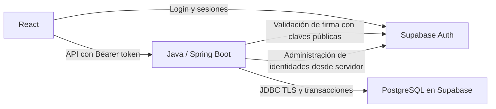

# Arquitectura y stack

**Versión:** 1.0 final, aprobada. Alcance vigente definido en la [especificación general](00-especificacion.md).

## Componentes

| Parte | Selección y responsabilidad |
|---|---|
| Backend | Java 21 y Spring Boot, monolito organizado por módulos de negocio. |
| Identidad y autenticación | Supabase Auth: credenciales, login y sesiones. |
| Autorización | Spring Security valida JWT de Supabase y comprueba Usuario activo y rol vigente. |
| Persistencia | PostgreSQL administrado en Supabase, acceso desde Java con JPA/Hibernate. |
| Frontend | React, TypeScript, Vite y React Router. |
| Interfaz y gráficos | Tailwind CSS, shadcn/ui, Chart.js y tabla coloreada para semana típica. |
| Ejecución | App local mediante Docker Compose o despliegue web; ambos conectan al mismo tipo de servicios Supabase. |

La app puede presentarse localmente; requiere internet para Auth y base de datos. Puede publicarse con una URL HTTPS sin cambiar el dominio. El proveedor de alojamiento de Java/React se elige al desplegar; no se exige despliegue de producción, alta disponibilidad ni funcionamiento offline.

## Organización y acceso a datos

Módulos: cuentas, aulas, calendario, referencias, reservas y consultas/indicadores. Java calcula fechas, disponibilidad e indicadores y valida estados, permisos y concurrencia. Calendario y generación de ocurrencias comparten transacciones del dominio.

Spring Boot sirve la API bajo /api y el build estático de React bajo un mismo origen. En desarrollo Vite usa proxy a Java. Maven y npm gestionan dependencias, con versiones reproducibles al implementar. No se necesita Next ni un servidor Node de aplicación.

React usa Supabase solo para autenticación; todas las consultas y mutaciones del dominio pasan por Java. Las tablas del dominio se mantienen en un esquema no expuesto por la Data API o sin permisos de acceso para los roles públicos de Supabase. La clave pública de Auth no permite saltarse las reglas de Java. No se agregan Realtime, Storage, Edge Functions ni políticas duplicadas de negocio en el cliente.

## Autenticación y cuentas

El cliente de Supabase mantiene la sesión del navegador y renueva tokens conforme al proveedor. Java funciona como API autenticada por Bearer, sin una segunda sesión de servidor ni reloj de inactividad. Configurar validación de firma, emisor, audiencia y expiración con las claves públicas del proyecto. No confiar solo en decodificar el JWT. Configurar CORS para los orígenes de la app cuando corresponda; la API no utiliza cookies como credencial implícita.

La identidad Auth se vincula por UUID con Usuario. El estado activo y rol de Usuario son la autoridad para permisos y se revisan en solicitudes protegidas. Crear cuentas y cambiar contraseñas requiere Admin de la app y llamadas administrativas desde Java, con credencial privada. Los detalles de email, deshabilitación y límites de revocación están en documento 10.

## Persistencia e integridad

PostgreSQL contiene el dominio; Auth administra sus propios datos internos. JPA y migraciones solo gestionan el esquema de la app, sin modificar tablas internas de Auth. Mantener Usuario y especializaciones, aulas y subtipos, Reserva y DetalleReserva según documento 13.

Exclusión de solapamientos, control de versiones y transacciones conjuntas siguen siendo obligatorios. Usar conexión PostgreSQL compatible con el proveedor y un pool acotado a su límite de conexiones. Verificar las restricciones de exclusión y extensión necesaria en la base elegida. Los cambios administrativos de identidad por HTTP no forman parte de una transacción JDBC: el documento 15 define resultados y recuperación de fallos parciales.

## Operación

Docker Compose levanta la aplicación propia; PostgreSQL y Auth son servicios remotos administrados. No incorpora un servidor PostgreSQL local, una instalación local de Supabase ni un servicio de respaldos. La inicialización carga Admin y datos ficticios sin duplicar ni sobrescribir al reiniciar.

El build incluye componentes y gráficos sin CDN en tiempo de uso. Publicar requiere HTTPS y variables privadas en el host. No hay respaldos programados, política de retención ni prueba de restauración exigida. Los eventos del dominio se consultan técnicamente sin panel.

## Referencias

[Spring Security JWT](https://docs.spring.io/spring-security/reference/servlet/oauth2/resource-server/jwt.html), [Supabase JWT](https://supabase.com/docs/guides/auth/jwts), [conexión PostgreSQL](https://supabase.com/docs/guides/database/connecting-to-postgres), [React con Vite](https://react.dev/learn/build-a-react-app-from-scratch), [shadcn con Vite](https://ui.shadcn.com/docs/installation/vite) y [Chart.js](https://www.chartjs.org/docs/latest/getting-started/integration.html).
