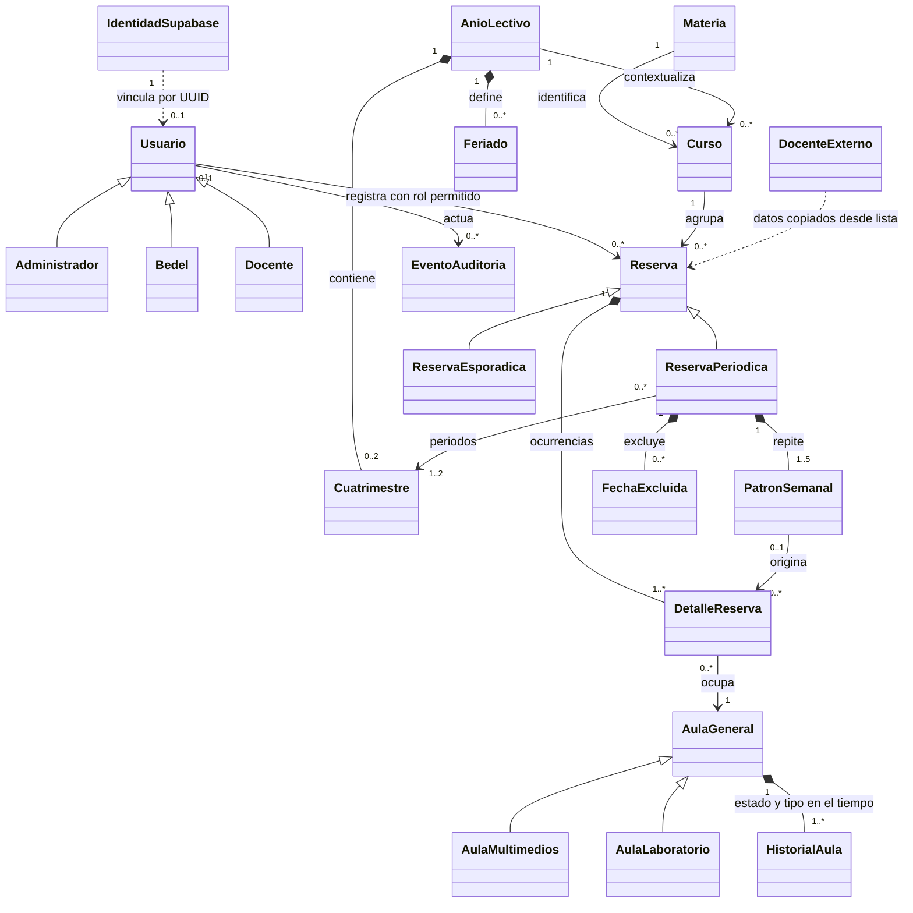

# Modelo consolidado de datos y reglas

**Versión:** 1.0 final, aprobada. Alcance vigente definido en la [especificación general](00-especificacion.md).

Estado: consolidación 1.0 de los acuerdos DA-01 a DA-85 y decisiones técnicas derivadas. Este documento define el modelo final de la especificación v1.0; los gráficos originales permanecen como fuentes históricas.

## Criterios de representación

Mantener Usuario y sus especializaciones, AulaGeneral y subtipos, Reserva y modalidades, AñoLectivo, Cuatrimestre y DetalleReserva. Agregar solo los conceptos necesarios por acuerdos posteriores. IDs internos numéricos estables; el identificador funcional del curso es compuesto y único. Los identificadores no se reciclan al dar de baja.

Los campos de versión son técnicos y permiten rechazar escrituras desactualizadas (DA-50). Fechas de clases se expresan en calendario local de Santa Fe; instantes de auditoría y sesiones conservan zona inequívoca. El día de semana de una fecha y el fin de una clase se calculan, no se editan separadamente.

## Diagrama de relaciones

El año admite menos de dos cuatrimestres solo en preparación. DocenteExterno es un registro de la lista fija, no otra cuenta ni una entidad con ABM. Administrador comparte permisos de Bedel sin ser una subclase de Bedel.

## Usuario y especializaciones

| Campo | Tipo conceptual | Regla |
|---|---|---|
| idUsuario | ID | Interno, estable. |
| email | Texto | Copia para consultas del email de Auth, autoridad de identidad y unicidad. Solo se actualiza desde el circuito administrativo del backend. |
| nombre, apellido | Texto | Identificación de persona conservada del diagrama; no vacíos. |
| supabaseAuthId | UUID único | Identidad de Supabase Auth; obligatorio en todo perfil utilizable. No es un ID numérico del dominio. |
| rol | Enum | ADMINISTRADOR, BEDEL o DOCENTE; uno solo. |
| activo | Booleano | Baja lógica, no elimina historial. |
| version | Número técnico | Evitar edición desactualizada. |
| turno | Enum del perfil Bedel | Opcional: MAÑANA, TARDE, NOCHE; descriptivo, sin restricciones horarias (DA-82). |
| legajo | Texto del perfil Docente | Opcional, descriptivo, sin relación obligatoria con lista ficticia ni unicidad funcional adicional (DA-82). |

Mapeo relacional: cuenta en Usuario y perfiles por especialización con la misma clave como PK/FK. Administrador conserva identidad de especialización, aunque no agrega datos propios. Un perfil corresponde al rol actual; cambiar rol actualiza perfil y permisos en una transacción. Esta representación evita tener que cambiar la identidad de Usuario para cambiar rol, conservando el esquema conceptual original.

La API comprueba activo y rol actuales para cada solicitud autenticada. No se almacenan contraseñas, hashes, contadores de intentos ni sesiones en el dominio. Supabase administra esos aspectos. El último Admin activo se protege también bajo concurrencia. IdentidadSupabase es un servicio externo al dominio; las migraciones no gestionan sus tablas internas. El vínculo estable es supabaseAuthId y no el email. Las altas parciales y cambios de email se resuelven según documento 15.

## Materia, curso y docente externo

| Concepto | Campos | Reglas |
|---|---|---|
| Materia | idMateria/codigoNumerico, nombre | Código numérico generado; representación con al menos tres dígitos, sin prefijo MAT. Nombre normalizado para evitar duplicados obvios de espacios/mayúsculas. |
| Curso | idCurso, materia, comision, anioLectivo | Único por materia + comisión + año. Identificador visible derivado: 001-A-2026. Comisión no vacía, normalizada a mayúsculas; el código puede crecer más allá de tres dígitos. |
| DocenteExterno | idExterno, nombre, apellido, email | Lista fija local, sin ABM ni conexión; selección exclusiva. |

El ID interno de Curso sirve para relaciones estables; el usuario identifica y busca el curso por el código compuesto y nombre. No son dos códigos que deba cargar. Crear materia/curso ocurre dentro del flujo de reserva, no en un módulo académico.

Reserva conserva ID externo y copia de nombre, apellido y email del docente. El ID no referencia obligatoriamente una cuenta de acceso. La copia preserva datos aunque se ajuste la lista de demo posteriormente.

## Aula y subtipos

| Campo | Regla |
|---|---|
| idAula | ID interno. |
| identificador | Texto obligatorio, único; no reciclar incluso ante baja lógica para evitar confusión histórica. |
| ubicacion/edificio, piso | Datos de ubicación originales; piso entero, permite cero y subsuelos. No se crea ABM de edificios. |
| capacidad | Entero positivo: personas. |
| estado | HABILITADA, INHABILITADA, MANTENIMIENTO. |
| bajaEn | Instante opcional de baja lógica, independiente de los estados originales; sin restauración. |
| tipo | GENERAL, MULTIMEDIOS, LABORATORIO; consistente con subtipo. |
| tipoPizarron | TIZA o FIBRON según original. |
| ventiladores, aireAcondicionado | Booleanos. |
| televisor, proyector, computadora | Booleanos de AulaMultimedios. |
| cantidadPC | Entero no negativo de AulaLaboratorio, exclusivamente descriptivo. |
| version | Control técnico de modificaciones concurrentes. |

Preservar tabla base y tablas de subtipos con PK/FK compartida. General no exige una tabla adicional sin atributos. Cambiar tipo exige ajustar el subtipo coherentemente y verificar reservas futuras/en curso; no se permite una combinación de tipo y perfil incompatible.

### HistorialAula

Registros con aula, desde, hasta opcional, estado, tipo y condición de baja. El intervalo es [desde, hasta), sin solapamientos; el registro actual no tiene fin. Al crear aula comienza la cobertura. Un cambio de estado/tipo/baja cierra el intervalo anterior y abre el siguiente en la misma transacción.

Conservar tipo junto a estado permite que una reclasificación actual no cambie retroactivamente los desgloses históricos. No se versiona todo el equipamiento ni se agrega interfaz de edición histórica. Los datos ficticios precargados incluyen intervalos coherentes con las reservas históricas que se quieren demostrar.

Para fechas futuras, se proyecta la condición actual mientras no haya un cambio registrado; las métricas futuras son previsión. No inferir cobertura antes del primer intervalo conocido. DA-85 excluye del cálculo de ocupación el estado administrativo actual o anterior del año: controla operaciones, no disponibilidad del espacio. No se agrega historial de estados del año. El cálculo usa fechas, apertura, feriados e HistorialAula y cuenta solo módulos completos habilitados de 30 minutos, conforme al documento 09. Los instantes reales de cambios se conservan sin redondear; para desglosar un módulo por tipo se usa el tipo al inicio.

## Calendario

| Concepto | Campos | Reglas |
|---|---|---|
| AnioLectivo | id, anioCalendario, estado, version | Año único; EN_PREPARACION, HABILITADO, CERRADO. Identidad del año calendario no se cambia si hay cursos o reservas dependientes. |
| Cuatrimestre | id, anioLectivo, numero, inicio, fin | Número 1 o 2, único dentro del año. Inicio ≤ fin, ambos dentro del año calendario, sin solapamiento y primero anterior al segundo. Sin estado propio. |
| Feriado | id, anioLectivo, fecha, descripcion | Fecha única del año, descripción no vacía. No cambios retroactivos. |

Fechas inicial/final del cuatrimestre inclusivas. La pertenencia anual de Curso determina el año de Reserva; no repetir otro año editable en cabecera. Una reserva esporádica de varias fechas debe permanecer dentro de ese año. Periódica anual referencia los dos cuatrimestres de ese mismo año, cuatrimestral uno. PeríodoAsignado es la relación de esas referencias, con par único.

## Reserva y requisitos del pedido

| Campo | Regla |
|---|---|
| idReserva | ID interno. |
| registradoPor | Usuario con rol Admin/Bedel al registrar; conservar identidad aunque luego cambie de rol. |
| curso | Referencia al Curso anual. |
| docenteExternoId, nombreDocente, apellidoDocente, emailDocente | Datos copiados de lista al seleccionar. Email solo accesible a roles operativos. |
| cantidadAlumnosPrevista | Entero positivo; único número de grupo y requisito de capacidad. |
| tipoAulaSolicitado | Enum de tipo. |
| requisitos | Pizarrón opcional y recursos booleanos requeridos. No incluir cantidadPC. |
| fechaRegistro | Instante del alta confirmada. |
| estado | CONFIRMADA si queda algún detalle no cancelado; CANCELADA si todos lo están. |
| version | Se incrementa también al cambiar detalles/patrón asociados. |

Un recurso requerido debe estar presente. Un recurso no marcado no exige ausencia: simplemente no se filtra por él. No admitir como requisito un recurso de un subtipo diferente al solicitado. Los requisitos se conservan para validar cambios de aulas y reasignaciones.

PENDIENTE no se guarda como estado de Reserva: existe solo en la preparación del frontend. MotivoCancelacion de cabecera se sustituye por motivo en cada detalle, ya que las fechas pueden cancelarse por causas diferentes. No agregar un motivo resumen redundante.

Docente, curso, alumnos, tipo y equipamiento solicitados no se editan después de iniciada la serie (DA-47/83). Antes pueden cambiarse revalidando todas las asignaciones. Después, un cambio de esos datos requiere cancelar futuras afectadas y registrar otra reserva.

## ReservaPeriodica y patrón

| Campo o relación | Regla |
|---|---|
| reservaId | PK/FK a cabecera. |
| modalidad | CUATRIMESTRAL o ANUAL. |
| periodosAsignados | Uno o dos cuatrimestres del año del curso. |
| continuidadCanceladaEn | Instante opcional: se canceló toda la continuidad futura. No cambia el estado histórico de cabecera. |
| patrones | Uno por día seleccionado, de lunes a viernes. |

PatronSemanal contiene ID, reserva periódica, día de semana, hora de inicio y cantidad de módulos. Unicidad de día dentro de la serie. Sustituye la simple lista de días/JSON del original porque DA-24 admite horas distintas por día. Las reprogramaciones puntuales no lo modifican.

ContinuidadCanceladaEn se establece cuando una cancelación deja a la serie sin ocurrencias futuras vigentes, no por el mero paso del tiempo. La actualización del calendario no extiende esa serie. Una serie finalizada naturalmente puede extenderse mientras el año permita cambios y aparezcan nuevas fechas futuras.

## DetalleReserva

| Campo | Regla |
|---|---|
| idDetalle | ID interno. |
| reserva | Cabecera obligatoria. |
| aula | Exactamente una. |
| fecha, horaInicio, cantidadModulos | Asignación real actual. Módulos 1 o más de 30 minutos, horario dentro de 07–23 y del mismo día. |
| fin | Derivado de inicio y módulos; no es un campo editable independiente. |
| estado | CONFIRMADA o CANCELADA. |
| motivoCancelacion, canceladoEn, canceladoPor | Requeridos al cancelar; no borrado físico. |
| patronOrigen | En periódicas, patrón que originó la clase; ausente en esporádicas. |
| fechaOriginal | En periódicas, fecha nominal del patrón que representa; permanece al reprogramar. |

La pareja reserva periódica + fechaOriginal identifica una clase de la serie. Evita regenerarla al retirar un feriado si ya se movió a otra fecha. Exigir coherencia de fechaOriginal con patronOrigen. Para nuevas fechas, la búsqueda del aula antecedente usa el mismo patronOrigen, aunque una ocurrencia anterior haya sido reprogramada a otro día.

FechaExcluida contiene reserva periódica + fecha original, únicas. Se conserva al confirmar una exclusión manual; no crea detalle cancelado. Feriados y fechas ya iniciadas no se guardan como exclusiones manuales: se derivan del calendario y tiempo, permitiendo DA-55. Los detalles cancelados tampoco se convierten en exclusiones: ya son la evidencia que impide regenerarlos.

## Integridad y operaciones conjuntas

- Todas las FK a identidad histórica usan protección frente a borrado incompatible. Bajas de Usuario y Aula son lógicas.
- Mutaciones de múltiples detalles se validan y guardan completas o no se guardan. Si una fecha empieza durante la edición, se rechaza la operación y se vuelve a revisión; no se edita silenciosamente un subconjunto distinto al confirmado.
- Las reservas simultáneas de una misma aula no pueden solaparse. Usar restricción de exclusión de intervalos en PostgreSQL para detalles CONFIRMADOS, con extremos [inicio, fin); complementarla con validaciones que permitan informar conflictos de forma útil.
- Coordinar operaciones de calendario, aulas y reservas dentro de transacciones para evitar que un aula se deshabilite mientras se confirma una clase, o que se cambie calendario sobre una validación anterior. La implementación fijará un orden único de bloqueo; no se deja resuelto solo mediante comprobaciones previas del frontend.
- Una actualización de calendario calcula las nuevas fechas otra vez al confirmar; no confía en un resumen antiguo. Conflictos o versiones cambiadas invalidan la operación conjunta.
- Proteger unicidad de email, curso, materia y último Admin bajo concurrencia mediante persistencia/transacción, no solo comprobaciones de pantalla.

Las restricciones de exclusión y rangos de PostgreSQL admiten expresar no solapamiento; la elección exacta de columnas/rango se concretará en migraciones, sin introducir SQL de implementación en esta especificación. [Rangos](https://www.postgresql.org/docs/current/rangetypes.html), [restricciones](https://www.postgresql.org/docs/current/ddl-constraints.html).

## Auditoría y autenticación

EventoAuditoria registra actor, instante, operación, tipo/ID de entidad y resultado de mutaciones de cuentas, aulas, calendario y reservas. Incluye cambios necesarios para explicar la operación sin contraseñas, tokens ni credenciales administrativas. Eventos y mutaciones locales exitosas comparten transacción; los resultados de llamadas de Auth se registran según lo conocido, sin prometer atomicidad distribuida.

No se replica la bitácora interna de autenticación de Supabase. La auditoría del dominio se consulta técnicamente y se conserva durante la vida de la base, sin panel ni purga automática. La validación JWT y los límites de cierre/renovación siguen el documento 10; no hay entidad de sesión propia.

## Trazabilidad de cambios al DER y clases originales

| Cambio | Justificación |
|---|---|
| Registrador pasa de Bedel a Usuario autorizado | DA-06 permite Admin registrar. |
| Materia y Curso anual con código compuesto | DA-10/48/52, sin integración académica. |
| Docente externo como referencia simulada independiente | DA-09/15, sin exigir cuenta. |
| Cantidad de alumnos y requisitos en Reserva | DA-31/46, antes solo estaban en los flujos. |
| Estado y motivo en detalle | DA-21/22; quitar motivo único de cabecera. |
| Patrón semanal con horario | DA-24, reemplaza lista de días sin horario. |
| Exclusión, fecha original y continuidad cancelada | DA-54 a DA-60, generación sin recuperar canceladas o duplicar excepciones. |
| Historial de estado/tipo de aula | DA-39 y desglose por tipo de indicadores. |
| Año 0..2 mientras se prepara, exactamente 2 al habilitar | DA-11/66/68. |
| Cuatrimestre sin estado independiente | DA-67. |
| Cardinalidad periódica–cuatrimestre corregida | Descripción original y DA-16. |
| PENDIENTE no persistido, módulo 30, días lunes–viernes | DA-12/14/19. |

## Precisiones finales de edición

DA-82 conserva turno/legajo opcionales y descriptivos. DA-83 fija requisitos compartidos al iniciar la serie. DA-84 exige que reprogramaciones periódicas permanezcan en los períodos asignados; para una recuperación fuera se cancela el detalle original y se crea una esporádica. DA-85 precisa el denominador de ocupación con módulos completos y sin historial de estados del año. No hay preguntas funcionales abiertas en este modelo; su implementación debe cumplir las restricciones y criterios de los documentos de casos y pruebas.
