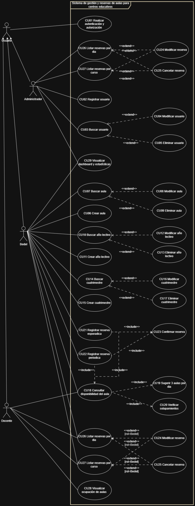

# Especificación de requerimientos

Fuente: [DOCX original](../definicion-alto-nivel/02_Especificacion%20de%20requerimientos.docx). Transcripción del cuerpo del documento en orden de lectura; tablas desplegadas por fila y celda, imágenes conservadas. No corrige contradicciones del original.

SEMINARIO INTEGRADOR

PLANTILLA 02: ESPECIFICACIÓN DE REQUERIMIENTOS

Fecha de Presentación

19/12/2025

Integrantes del equipo de trabajo

Canavesio, Gabriel

Sánchez, Santiago

Sandria, Exequiel

## 1. Descripción del Alcance del Problema

Descripción operativa.Digitalización del circuito de reservas y asignaciones de aulas para Bedelía, incorporando visualización de ocupación para Docentes y herramientas de análisis para la toma de decisiones. Se gestionan tipos de aula (multimedios, informáticas, sin recursos adicionales), reservas esporádicas y periódicas (cuatrimestrales o anuales).

Alcance funcional:

Autenticación y autorización.

Gestión de usuarios: ABM de administradores y bedeles.

Gestión de aulas: búsqueda, modificación, eliminación y alta.

Gestión de años lectivos y cuatrimestres: ABM.

Gestión de reservas: registro esporádico y periódico; obtención de disponibilidad; registro definitivo; manejo de solapamientos.

Listados de reservas por día y por curso.

Visualización de ocupación para Docentes; Bedelía y Admin con dashboards y estadísticas.

Fuera de alcance:Gestión de cátedras; gestión de docentes. Se mantienen fuera para acotar el dominio.

## 2. Requerimientos Funcionales

### RF #1: Autenticación y autorización

El sistema debe permitir a Administradores, Bedeles y Docentes iniciar y cerrar sesión aplicando control de acceso por rol y bloqueo temporal tras cinco intentos fallidos.

### RF #2: Registrar usuario

El sistema debe permitir al Administrador crear usuarios con nombre, email, rol y contraseña, validando unicidad de email y políticas de contraseña.

### RF #3: Buscar usuarios

El sistema debe permitir al Administrador buscar usuarios por nombre, email, rol y estado, con paginación y ordenamiento de resultados.

### RF #4: Modificar usuario

El sistema debe permitir al Administrador editar datos y rol de un usuario asegurando que no se degrade ni elimine al último Administrador activo.

### RF #5: Eliminar usuario (baja lógica)

El sistema debe permitir al Administrador deshabilitar usuarios con confirmación, impidiendo la baja si es el último Administrador activo y registrando auditoría.

### RF #6: Crear aula

El sistema debe permitir a Administradores y Bedeles crear aulas indicando identificador, edificio/piso, tipo, capacidad, características y estado, validando identificador único.

### RF #7: Buscar aulas

El sistema debe permitir a Bedeles buscar aulas por número, tipo, capacidad mínima, estado y características, devolviendo aulas con capacidad mayor o igual a la requerida.

### RF #8: Modificar aula

El sistema debe permitir a Bedeles actualizar datos y estado de un aula bloqueando la inhabilitación si existen reservas futuras y registrando auditoría

### RF #9: Eliminar aula (baja lógica)

El sistema debe permitir a Bedeles dar de baja aulas con confirmación, impidiendo la operación si existen reservas futuras y dejando traza de auditoría

### RF #10: Buscar año lectivo

El sistema debe permitir a los Administradores listar años lectivos por año y estado con filtros y paginación.

### RF #11: Crear año lectivo

El sistema debe permitir a los Administradores crear años lectivos únicos definiendo su estado y estableciendo que cada año contiene exactamente dos cuatrimestres.

### RF #12: Modificar año lectivo

El sistema debe permitir a los Administradores actualizar los atributos del año lectivo manteniendo la consistencia con sus cuatrimestres asociados.

### RF #13: Eliminar año lectivo

El sistema debe permitir a los Administradores eliminar un año lectivo solo si no tiene cuatrimestres ni reservas asociadas, registrando auditoría.

### RF #14: Buscar cuatrimestre

El sistema debe permitir a los Administradores listar cuatrimestres por año, fechas de inicio y fin y estado, con filtros y paginación.

### RF #15: Crear cuatrimestre

El sistema debe permitir a los Administradores crear cuatrimestres para un año lectivo definiendo fechas de inicio y fin y estado, evitando solapamientos y más de dos por año.

### RF #16: Modificar cuatrimestre

El sistema debe permitir a los Administradores actualizar fechas y estado de un cuatrimestre validando que no se solape con otro del mismo año.

### RF #17: Eliminar cuatrimestre

El sistema debe permitir a Administradores eliminar un cuatrimestre solo si no existen reservas asociadas

### RF #18: Consultar disponibilidad de aulas

El sistema debe permitir a Bedeles y Docentes consultar disponibilidad por tipo de aula, capacidad mínima, características, fecha o período, hora de inicio y duración en múltiplos de 30 minutos, excluyendo aulas inactivas y solapamientos.

### RF #19: Sugerir aulas disponibles

El sistema debe sugerir a Bedeles, para cada día consultado, tres aulas disponibles con capacidad más cercana por exceso a la solicitada, mostrando ubicación y características.

### RF #20: Verificar solapamientos

El sistema debe verificar, antes de confirmar o modificar reservas, la existencia de superposiciones con reservas vigentes del aula y detallar los conflictos detectados.

### RF #21: Registrar reserva esporádica

El sistema debe permitir a Bedeles registrar reservas para una o más fechas específicas indicando curso, docente, email, tipo de aula, capacidad mínima, características, hora de inicio y duración, validando fechas futuras y ausencia de solapamientos.

### RF #22: Registrar reserva por período

El sistema debe permitir a Bedeles registrar reservas periódicas dentro de un cuatrimestre o año seleccionando días, hora de inicio y duración, derivando ocurrencias y validando solapamientos

### RF #23: Confirmar reserva

El sistema debe permitir a Bedeles confirmar reservas válidas generando las mismas de forma transaccional y emitiendo notificaciones.

### RF #24: Modificar reserva

El sistema debe permitir a Bedeles y Administradores modificar aula, horarios, fechas o datos asociados revalidando reglas y solapamientos antes de persistir.

### RF #25: Cancelar reserva

El sistema debe permitir a Bedeles y Administradores cancelar reservas total o parcialmente por fecha registrando el motivo e impidiendo cancelar ocurrencias pasadas.

### RF #26: Listar reservas por día

El sistema debe permitir a Administradores, Bedeles y Docentes listar reservas de una fecha con filtros por tipo y aula, mostrando docente, curso, aula y horario.

### RF #27: Listar reservas por curso

El sistema debe permitir a Administradores, Bedeles y Docentes obtener el listado anual de reservas de un curso o cátedra ordenado cronológicamente.

### RF #28: Visualización de ocupación (agenda Docente)

El sistema debe permitir a Docentes visualizar en modo solo lectura una agenda diaria o semanal con disponibilidad y reservas asociadas.

### RF #29: Dashboards y estadísticas

El sistema debe permitir a Administradores y Bedeles visualizar paneles con indicadores de ocupación, horas reservadas, conflictos y demanda por rangos de fechas.

## 3. Requerimientos No Funcionales

### RNF #1: Seguridad

Autorización por roles (Admin/Bedel/Docente) en backend.

Contraseñas hasheadas.

### RNF #2: Confiabilidad

Transacciones ACID en PostgreSQL para altas/modificaciones/cancelaciones de reservas.

Backups lógicos diarios con retención de 14 días.

### RNF #3: Rendimiento

p95: disponibilidad/listados < 1,5 s; altas/modificaciones de reservas periódicas < 2 s.

Índices en (aula, fecha, hora_inicio) y paginación obligatoria.

### RNF #4: Trazabilidad

Bitácora de autenticación y operaciones de reservas con usuario, timestamp y entidad

### RNF #5: Concurrencia

Soporte estable de 50 usuarios concurrentes (10% bedeles/admin, 90% docentes consultando) sin degradación por encima de p95 definido.

## 4. Diagrama de Casos de Uso

## 5. Fichas de Casos de Uso

### Nombre: Realizar autenticación y autorización — 01

Actores: Usuario (Administrador, Bedel, Docente).Objetivo: iniciar/cerrar sesión y habilitar permisos según rol.Precondiciones: usuario registrado y habilitado.Postcondiciones:

Éxito: sesión activa y menú según rol.

Fracaso: acceso denegado o cuenta bloqueada.Flujo Principal:

El caso de uso comienza cuando el usuario selecciona “Iniciar sesión”.

El sistema solicita usuario y contraseña.

El usuario ingresa credenciales y confirma.

El sistema valida y, si son correctas, crea la sesión y muestra el menú del rol.

El usuario puede cerrar sesión; el sistema invalida la sesión.Flujos Alternativos:A1) Credenciales inválidas → mensaje y reintento.A2) Usuario inactivo → mensaje y fin.Flujos de Excepción:E1) 5 intentos fallidos → bloqueo temporal de 15 minutos.Asociaciones de Inclusión: No contempla.Asociaciones de Extensión: No contempla.Requerimientos Especiales: Política de contraseñas; registro de intentos.Observaciones: Autorización RBAC por rol.

### Nombre: Registrar usuario — 02

Actores: Administrador.Objetivo: dar de alta una cuenta (Administrador o Bedel) y asignar rol.Precondiciones: sesión de Administrador activa.Postcondiciones:

Éxito: usuario creado y habilitado con rol.

Fracaso: alta rechazada.Flujo Principal:

El caso de uso comienza cuando el administrador selecciona “Nuevo usuario”.

El sistema muestra formulario con nombre, email, rol, contraseña.

El administrador completa y confirma.

El sistema valida unicidad de email y políticas; persiste.Flujos Alternativos:A1) Datos inválidos/duplicados → marcar campos y volver a edición.Flujos de Excepción:E1) Error de almacenamiento → informar y finalizar sin cambios.Asociaciones de Inclusión: No contempla.Asociaciones de Extensión: No contempla.Requerimientos Especiales: Email único; mínima longitud de contraseña.Observaciones: Registrar auditoría de alta.

### Nombre: Buscar usuario — 03

Actores: Administrador.Objetivo: listar usuarios según criterios.Precondiciones: sesión de Administrador activa.Postcondiciones:

Éxito: resultados mostrados.

Fracaso: sin coincidencias.Flujo Principal:

El caso de uso comienza cuando el administrador accede a “Usuarios”.

El sistema presenta filtros (nombre/email, rol, estado).

El administrador ingresa criterios y presiona “Buscar”.

El sistema lista coincidencias paginadas.Flujos Alternativos:A1) Sin criterios → listar todos.Flujos de Excepción: No contempla.Asociaciones de Inclusión: No contempla.Asociaciones de Extensión:

Modificar usuario (condición: selecciona un usuario para editar).

Eliminar usuario (condición: selecciona un usuario para eliminar).Requerimientos Especiales: Paginación.Observaciones: —

### Nombre: Modificar usuario — 04

Actores: Administrador.Objetivo: actualizar datos y rol de una cuenta.Precondiciones: usuario existente.Postcondiciones:

Éxito: cambios guardados.

Fracaso: sin modificaciones.Flujo Principal:

El administrador selecciona “Modificar” desde el listado.

El sistema muestra datos editables.

El administrador edita y confirma.

El sistema valida y persiste.Flujos Alternativos: A1) Cancelar → fin.Flujos de Excepción: E1) Intento de degradar al último Administrador activo → impedir y notificar.Asociaciones de Inclusión: No contempla.Asociaciones de Extensión: No contempla.Requerimientos Especiales: Auditoría de cambios.Observaciones: —

### Nombre: Eliminar usuario — 05

Actores: Administrador.Objetivo: dar de baja lógica una cuenta.Precondiciones: usuario existente.Postcondiciones:

Éxito: usuario deshabilitado.

Fracaso: operación cancelada.Flujo Principal:

El administrador selecciona “Eliminar” sobre un usuario.

El sistema solicita confirmación.

El administrador confirma.

El sistema deshabilita la cuenta y notifica.Flujos Alternativos: A1) Cancelar → fin.Flujos de Excepción: E1) Último Administrador activo → impedir.Asociaciones de Inclusión: No contempla.Asociaciones de Extensión: No contempla.Requerimientos Especiales: Trazabilidad.Observaciones: —

### Nombre: Crear aula — 06

Actores: Administrador, Bedel.Objetivo: registrar un aula con tipo, capacidad, ubicación, estado y características.Precondiciones: sesión válida.Postcondiciones:

Éxito: aula creada.

Fracaso: alta rechazada.Flujo Principal:

El actor elige “Nueva aula”.

El sistema solicita identificador, edificio/piso, tipo, capacidad, características, estado.

El actor completa y confirma.

El sistema valida y persiste.Flujos Alternativos: A1) Identificador duplicado → informar y volver.Flujos de Excepción: No contempla.Asociaciones de Inclusión: No contempla.Asociaciones de Extensión: No contempla.Requerimientos Especiales: Identificador único.Observaciones: Aula inactiva no es reservable.

### Nombre: Buscar aula — 07

Actores: Bedel.Objetivo: realizar la búsqueda de un aula por uno o más criterios.Precondiciones: estar autenticado en el sistema.Postcondiciones:

Éxito: el sistema muestra todas las aulas que cumplen con los criterios.

Fracaso: no se encuentran aulas que cumplan con los criterios.Flujo Principal:

El caso de uso comienza cuando el bedel selecciona “Buscar Aulas”.

El sistema presenta criterios (número de aula, tipo de aula, capacidad, estado).

El actor ingresa criterios y presiona “Buscar”.

El sistema presenta aulas disponibles mostrando: número, piso, tipo, capacidad y estado (Habilitada/Inhabilitada).

El actor selecciona una de las aulas.

El caso de uso termina.Flujos Alternativos:3.A) El actor no ingresa criterios y presiona “Buscar” → continuar en 4 con listado completo.5.A) No existen aulas que cumplan con los criterios → 5.A.1) El sistema informa que no hay coincidencias. 5.A.2) El caso de uso termina.6.A) El actor selecciona un aula para modificarla → se invoca Modificar aula y luego termina.6.B) El actor selecciona un aula para eliminarla → se invoca Eliminar aula y luego termina.Flujos de Excepción: No contempla.Asociaciones de Inclusión: No contempla.Asociaciones de Extensión:

Modificar aula — Condición: el actor selecciona “Modificar”.

Eliminar aula — Condición: el actor selecciona “Eliminar”.Requerimientos Especiales: No contempla.Observaciones: criterios no excluyentes; búsqueda por capacidad devuelve aulas con capacidad ≥ requerida.

### Nombre: Modificar aula — 08

Actores: Bedel.Objetivo: actualizar datos/estado del aula.Precondiciones: aula existente.Postcondiciones:

Éxito: cambios guardados.

Fracaso: sin cambios.Flujo Principal:

Se inicia desde “Buscar aula”.

El sistema muestra datos del aula.

El actor edita y confirma.

El sistema valida y actualiza.Flujos Alternativos: A1) Cancelar → fin.Flujos de Excepción: E1) Aula con reservas futuras y se intenta inhabilitar → informar y bloquear.Asociaciones de Inclusión: No contempla.Asociaciones de Extensión: No contempla.Requerimientos Especiales: Auditoría.Observaciones: —

### Nombre: Eliminar aula — 09

Actores: Bedel.Objetivo: dar de baja un aula.Precondiciones: aula existente.Postcondiciones:

Éxito: aula dada de baja lógica.

Fracaso: operación cancelada.Flujo Principal:

Se inicia desde “Buscar aula”.

El sistema solicita confirmación.

El actor confirma.

El sistema registra la baja.Flujos Alternativos: A1) Cancelar → fin.Flujos de Excepción: E1) Reservas futuras asociadas → informar y bloquear.Asociaciones de Inclusión: No contempla.Asociaciones de Extensión: No contempla.Requerimientos Especiales: —Observaciones: —

### Nombre: Buscar año lectivo — 10

Actores: Administrador.Objetivo: listar años lectivos por criterios.Precondiciones: sesión de Administrador activa.Postcondiciones:

Éxito: resultados mostrados.

Fracaso: sin resultados.Flujo Principal:

Acceder a “Años lectivos”.

Ingresar criterios (año, estado).

Listar resultados.Flujos Alternativos: —Flujos de Excepción: —Asociaciones de Inclusión: No contempla.Asociaciones de Extensión: —Requerimientos Especiales: —Observaciones: —

### Nombre: Crear año lectivo — 11

Actores: Administrador.Objetivo: dar de alta un año lectivo.Precondiciones: sesión activa.Postcondiciones:

Éxito: año creado.

Fracaso: alta rechazada.Flujo Principal:

“Nuevo año”.

Completar año y estado.

Guardar.Flujos Alternativos: A1) Año duplicado → informar.Flujos de Excepción: —Asociaciones de Inclusión: No contempla.Asociaciones de Extensión: —Requerimientos Especiales: —Observaciones: Un año contiene dos cuatrimestres.

### Nombre: Modificar año lectivo — 12

Actores: Administrador.Objetivo: editar atributos del año lectivo.Precondiciones: año existente.Postcondiciones:

Éxito: cambios persistidos.

Fracaso: sin cambios.Flujo Principal: editar → validar → guardar.Flujos Alternativos: —Flujos de Excepción: —Asociaciones de Inclusión: No contempla.Asociaciones de Extensión: —Requerimientos Especiales: —Observaciones: —

### Nombre: Eliminar año lectivo — 13

Actores: Administrador.Objetivo: dar de baja un año lectivo.Precondiciones: sin cuatrimestres asociados.Postcondiciones:

Éxito: baja aplicada.

Fracaso: cancelado.Flujo Principal: seleccionar → confirmar → registrar.Flujos Alternativos: —Flujos de Excepción: —Asociaciones de Inclusión: —Asociaciones de Extensión: —Requerimientos Especiales: —Observaciones: —

### Nombre: Buscar cuatrimestre — 14

Actores: Administrador.Objetivo: listar cuatrimestres por criterios.Precondiciones: año lectivo existente.Postcondiciones:

Éxito: resultados mostrados.

Fracaso: sin resultados.Flujo Principal: filtros (año, fecha inicio/fin, estado) → buscar → listar.Flujos Alternativos: —Flujos de Excepción: —Asociaciones de Inclusión: —Asociaciones de Extensión: —Requerimientos Especiales: —Observaciones: —

### Nombre: Crear cuatrimestre — 15

Actores: Administrador.Objetivo: dar de alta un cuatrimestre asociado a un año lectivo.Precondiciones: año lectivo existente.Postcondiciones:

Éxito: cuatrimestre creado.

Fracaso: alta rechazada.Flujo Principal:

“Nuevo cuatrimestre”.

Completar fecha inicio, fecha fin, año, estado.

Validar no solape con otros cuatrimestres del mismo año.

Guardar.Flujos Alternativos: A1) Solapamiento → informar y volver.Flujos de Excepción: —Asociaciones de Inclusión: —Asociaciones de Extensión: —Requerimientos Especiales: —Observaciones: Dos cuatrimestres por año.

### Nombre: Modificar cuatrimestre — 16

Actores: Administrador.Objetivo: editar fechas/estado del cuatrimestre.Precondiciones: cuatrimestre existente.Postcondiciones:

Éxito: cambios guardados.

Fracaso: sin cambios.Flujo Principal: editar → validar solape → guardar.Flujos Alternativos: —Flujos de Excepción: —Asociaciones de Inclusión: —Asociaciones de Extensión: —Requerimientos Especiales: —Observaciones: —

### Nombre: Eliminar cuatrimestre — 17

Actores: Administrador.Objetivo: dar de baja un cuatrimestre.Precondiciones: sin dependencias críticas (reservas asociadas).Postcondiciones:

Éxito: baja aplicada.

Fracaso: cancelado.Flujo Principal: seleccionar → confirmar → registrar.Flujos Alternativos: —Flujos de Excepción: —Asociaciones de Inclusión: —Asociaciones de Extensión: —Requerimientos Especiales: —Observaciones: —

### Nombre: Consultar disponibilidad de aulas — 18

Actores: Bedel, Docente.Objetivo: obtener disponibilidad por criterios y período/fechas.Precondiciones: sesión activa; criterios válidos.Postcondiciones:

Éxito: lista de aulas disponibles por día.

Fracaso: sin disponibilidad.Flujo Principal:

El actor ingresa criterios: tipo, capacidad mínima, características, fecha(s) o período, hora inicio y duración (múltiplo de 30).

El sistema valida y busca aulas; descarta solapamientos y aulas inactivas.

El sistema presenta resultados por día.Flujos Alternativos: A1) Sin aulas → ofrecer detalle de menor solapamiento.Flujos de Excepción: —Asociaciones de Inclusión: —Asociaciones de Extensión:

Sugerir 3 aulas por día — Condición: rol = Bedel.Requerimientos Especiales: Orden por capacidad cuando hay sugerencias.Observaciones: Usado por los CU de registro.

### Nombre: Sugerir 3 aulas por día — 19

Actores: Bedel.Objetivo: presentar las 3 primeras aulas disponibles por día y permitir seleccionar una por día.Precondiciones: resultados de disponibilidad vigentes.Postcondiciones:

Éxito: selecciones por día registradas para confirmación.

Fracaso: sin selección.Flujo Principal:

El sistema muestra top 3 por día (capacidad ascendente, con ubicación y características).

El bedel selecciona un aula por día y confirma.Flujos Alternativos: —Flujos de Excepción: —Asociaciones de Inclusión: —Asociaciones de Extensión: Extiende Consultar disponibilidad de aulas — Condición: [rol=Bedel].Requerimientos Especiales: —Observaciones: —

### Nombre: Verificar solapamientos — 20

Actores: Sistema (disparado por Bedel/Administrador).Objetivo: detectar superposiciones de reservas en un aula.Precondiciones: propuesta de reserva disponible.Postcondiciones:

Éxito: sin conflictos.

Fracaso: conflictos listados.Flujo Principal:

Consultar reservas vigentes del aula en el rango indicado.

Detectar superposición.

Informar resultado.Flujos Alternativos: —Flujos de Excepción: —Asociaciones de Inclusión: —Asociaciones de Extensión: Extiende Confirmar reserva y Modificar reserva — Condición: antes de persistir.Requerimientos Especiales: —Observaciones: Obligatorio.

### Nombre: Registrar reserva esporádica — 21

Actores: Bedel.Objetivo: registrar reserva para uno o más días específicos.Precondiciones: sesión activa; datos de curso y docente.Postcondiciones:

Éxito: reserva creada.

Fracaso: no se registra.Flujo Principal:

Iniciar registro.

Ingresar datos: curso/cátedra, docente, email, tipo de aula, capacidad mínima, características, fechas, hora inicio, duración (múltiplo de 30).

Validar.

Incluir Consultar disponibilidad de aulas.

Extensión Sugerir 3 aulas por día (si corresponde).

Seleccionar un aula por cada fecha.

Incluir Verificar solapamientos.

Incluir Confirmar reserva.Flujos Alternativos: A1) Fechas en pasado → error y volver a edición.Flujos de Excepción: E1) Duración no válida → error.Asociaciones de Inclusión: ver pasos.Asociaciones de Extensión: —Requerimientos Especiales: Reservas por tipo de aula.Observaciones: —

### Nombre: Registrar reserva por período — 22

Actores: Bedel.Objetivo: registrar reserva recurrente cuatrimestral o anual.Precondiciones: período académico definido.Postcondiciones:

Éxito: ocurrencias creadas.

Fracaso: no se registra.Flujo Principal:

Elegir modalidad “Por período”.

Ingresar período, días de semana, hora inicio y duración (múltiplo de 30), tipo de aula, capacidad y características.

Derivar fechas del período.

Incluir Consultar disponibilidad de aulas.

Extensión Sugerir 3 aulas por día (si corresponde).

Seleccionar aulas por día.

Incluir Verificar solapamientos.

Incluir Confirmar reserva.Flujos Alternativos: A1) Sin días hábiles seleccionados → informar.Flujos de Excepción: —Asociaciones de Inclusión: ver pasos.Asociaciones de Extensión: —Requerimientos Especiales: Dentro del rango del cuatrimestre/año.Observaciones: —

### Nombre: Confirmar reserva — 23

Actores: Bedel.Objetivo: persistir definitivamente las asignaciones seleccionadas.Precondiciones: selecciones válidas y sin solapamientos.Postcondiciones:

Éxito: reserva registrada.

Fracaso: operación cancelada.Flujo Principal:

Mostrar resumen.

Confirmar.

Persistir.

Notificar.Flujos Alternativos: A1) Cancelar → fin.Flujos de Excepción: E1) Error de persistencia → informar y no registrar.Asociaciones de Inclusión: —Asociaciones de Extensión: —Requerimientos Especiales: Transaccionalidad.Observaciones: —

### Nombre: Modificar reserva — 24

Actores: Bedel, Administrador.Objetivo: cambiar aula/horario/fechas/datos de reserva.Precondiciones: reserva existente.Postcondiciones:

Éxito: reserva actualizada.

Fracaso: cambio rechazado.Flujo Principal:

Seleccionar reserva.

Editar.

Incluir Verificar solapamientos.

Guardar.Flujos Alternativos: A1) Modificar ocurrencias seleccionadas del período.Flujos de Excepción: E1) Conflicto → informar y cancelar.Asociaciones de Inclusión: ver pasos.Asociaciones de Extensión: —Requerimientos Especiales: Revalidar duración múltiplo de 30.Observaciones: Auditoría de cambios.

### Nombre: Cancelar reserva — 25

Actores: Bedel, Administrador.Objetivo: dar de baja total o por fecha una reserva.Precondiciones: reserva existente.Postcondiciones:

Éxito: baja aplicada.

Fracaso: sin cambios.Flujo Principal:

Elegir reserva.

Seleccionar alcance (total/por fecha) y motivo.

Confirmar.

Registrar baja y notificar.Flujos Alternativos: —Flujos de Excepción: —Asociaciones de Inclusión: —Asociaciones de Extensión: —Requerimientos Especiales: No cancelar ocurrencias pasadas.Observaciones: —

### Nombre: Listar reservas por día — 26

Actores: Administrador, Bedel, Docente.Objetivo: obtener la ocupación por fecha, agrupada por tipo de aula.Precondiciones: fecha válida.Postcondiciones:

Éxito: listado mostrado/impreso.

Fracaso: sin registros.Flujo Principal:

Ingresar fecha y filtros (tipo/aula).

Mostrar docente, curso, aula, hora inicio y fin, agrupado por tipo.Flujos Alternativos: A1) Exportar/Imprimir.Flujos de Excepción: —Asociaciones de Inclusión: —Asociaciones de Extensión: —Requerimientos Especiales: Paginación.Observaciones: —

### Nombre: Listar reservas por curso — 27

Actores: Administrador, Bedel, Docente.Objetivo: obtener reservas de un curso/cátedra por año.Precondiciones: curso/cátedra y año definidos.Postcondiciones:

Éxito: listado generado.

Fracaso: sin registros.Flujo Principal:

Ingresar curso/cátedra y año.

Mostrar ocurrencias.Flujos Alternativos: —Flujos de Excepción: —Asociaciones de Inclusión: —Asociaciones de Extensión: —Requerimientos Especiales: —Observaciones: —

### Nombre: Visualizar ocupación de aulas — 28

Actores: Docente.Objetivo: visualizar agenda por día/semana con disponibilidad y reservas.Precondiciones: sesión de Docente activa.Postcondiciones:

Éxito: agenda visible.

Fracaso: sin datos.Flujo Principal:

Elegir fecha y tipo.

Mostrar agenda.Flujos Alternativos: —Flujos de Excepción: —Asociaciones de Inclusión: —Asociaciones de Extensión: —Requerimientos Especiales: Sólo lectura.Observaciones: —

### Nombre: Visualizar dashboards y estadísticas — 29

Actores: Administrador, Bedel.Objetivo: visualizar indicadores de ocupación, horas reservadas, conflictos y demanda.Precondiciones: sesión activa; datos de reservas.Postcondiciones:

Éxito: paneles mostrados.

Fracaso: sin datos para filtros.Flujo Principal:

Ingresar a “Estadísticas”.

Seleccionar rango y filtros.

Mostrar KPIs y tablas.Flujos Alternativos: —Flujos de Excepción: —Asociaciones de Inclusión: —Asociaciones de Extensión: —Requerimientos Especiales: Sólo lectura.Observaciones: Insumos a partir de reservas confirmadas.

## Encabezados y recursos complementarios del original

Universidad Tecnológica Nacional  Facultad Regional Santa Fe Departamento Ingeniería en Sistemas de Información

