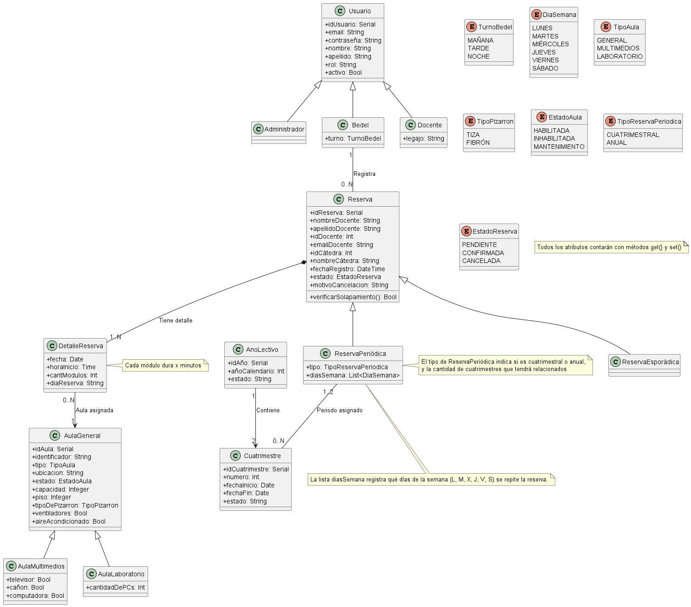
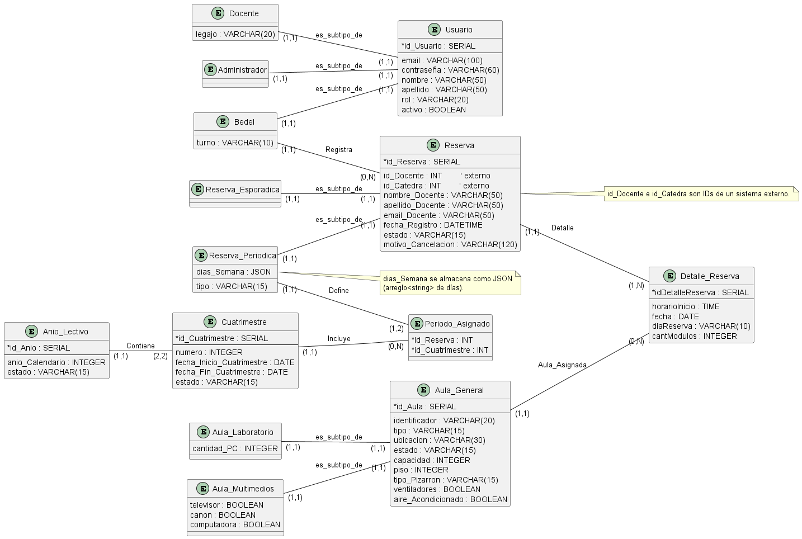

# Modelos de datos y de diseño

Fuente: [DOCX original](../definicion-alto-nivel/03_Modelos%20de%20Datos%20y%20de%20Dise%C3%B1o.docx). Transcripción del cuerpo del documento en orden de lectura; tablas desplegadas por fila y celda, imágenes conservadas. No corrige contradicciones del original.

SEMINARIO INTEGRADOR

PLANTILLA 03: MODELOS DE DATOS Y DE DISEÑO

TÍTULO DE LA IDEA/PROYECTO:

Fecha de Presentación

19/12/2025

Integrantes del equipo de trabajo

Canavesio, Gabriel

Sánchez, Santiago

Sandria, Exequiel

## 1. Listado de modelos generados

- MODELO 1: Diagrama de clases (de análisis)

- MODELO 2: Diagrama Entidad Relación

## 2. Modelo 1:

## 2.1 Modelo 1: Gráfico

## 2.2 Modelo 1: Descripción y justificación de elementos más importantes

Usuario → Administrador / Bedel / Docente.Usuario concentra identidad y credenciales; Administrador, Bedel y Docente especializan responsabilidades. Bedel incorpora atributos operativos como turno y habilitado.Este diseño centraliza autenticación y control de acceso y separa reglas por rol mediante herencia, evitando atributos nulos y reduciendo acoplamiento entre funcionalidades de administración, operación y consulta.

AulaGeneral → AulaMultimedios / AulaLaboratorio.AulaGeneral reúne identidad, ubicación, capacidad, estado y rasgos comunes; AulaMultimedios agrega equipamiento audiovisual y AulaLaboratorio agrega recursos informáticos.La herencia evita mezclar características incompatibles y habilita reglas y búsquedas específicas por tipo de aula sin condicionales dispersos.

Reserva y DetalleReserva.Reserva actúa como cabecera con datos del solicitante y alta; DetalleReserva representa cada ocurrencia concreta con fecha, inicio y cantidad de módulos, y se asigna a un aula.Una reserva puede materializar múltiples clases; las validaciones de solapamiento y la reprogramación se gestionan en la ocurrencia, permitiendo mover una sola clase sin alterar el resto.

AñoLectivo y Cuatrimestre.AñoLectivo define el ciclo académico y contiene exactamente dos Cuatrimestres con fechas de inicio y fin.Esta estructura encapsula el calendario institucional y ordena las ventanas temporales sobre las que operan las reservas recurrentes.

Reserva ↔ Cuatrimestre/AñoLectivo.La ReservaPeriódica se acota a uno o dos Cuatrimestres pertenecientes a un AñoLectivo; la ReservaEsporádica se define por fechas puntuales.Las recurrentes deben existir dentro de períodos académicos válidos, lo que evita ocurrencias fuera de rango y permite análisis y listados por período.

## 3. Modelo 2:

## 3.1 Modelo 2: Gráfico

## 3.2 Modelo 2: Descripción y justificación de elementos más importantes

Usuario, Administrador, Bedel, Docente (especialización).Usuario concentra identidad y credenciales; las entidades especializadas reflejan responsabilidades y atributos propios de cada rol.Separar credenciales de las responsabilidades clarifica reglas por rol, evita atributos irrelevantes en una única tabla y mejora la trazabilidad de acciones.

Reserva y Detalle_Reserva.Reserva guarda la cabecera del pedido; Detalle_Reserva representa cada ocurrencia con fecha, hora de inicio y módulos.La normalización por ocurrencia permite validar solapamientos en el nivel correcto y admite reprogramaciones puntuales sin afectar la cabecera.

Asignación de aula en el detalle.Cada Detalle_Reserva se vincula a exactamente un aula, mientras un aula puede participar en muchos detalles.La ocupación real sucede por ocurrencia y aula; ubicar el vínculo en el detalle facilita reasignaciones finas y la detección precisa de conflictos por fecha y horario.

Aulas y subtipos.Aula_General concentra identidad, capacidad, ubicación y estado; Aula_Multimedios y Aula_Laboratorio agregan equipamiento específico.La especialización evita columnas no aplicables y habilita criterios de disponibilidad y búsqueda coherentes con el tipo de aula.

Reservas periódicas y período académico.Las reservas recurrentes se vinculan a uno o dos Cuatrimestres del AñoLectivo, mientras las esporádicas se definen por fechas puntuales.La vinculación a cuatrimestres alinea la generación de ocurrencias con el calendario académico, previene fechas fuera de rango y habilita reportes por período.

## Encabezados y recursos complementarios del original

Universidad Tecnológica Nacional  Facultad Regional Santa Fe Departamento Ingeniería en Sistemas de Información

