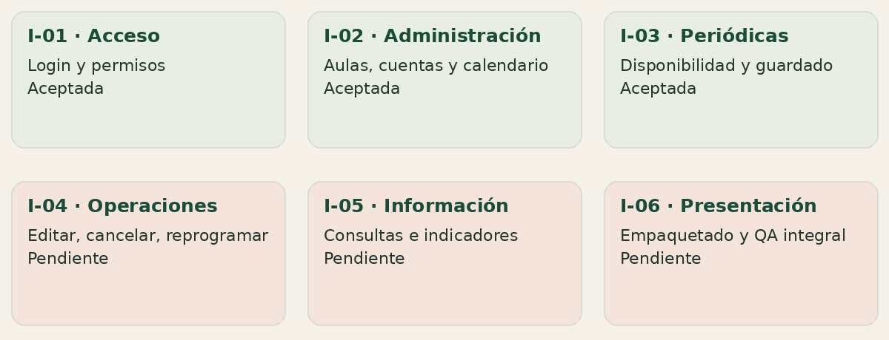
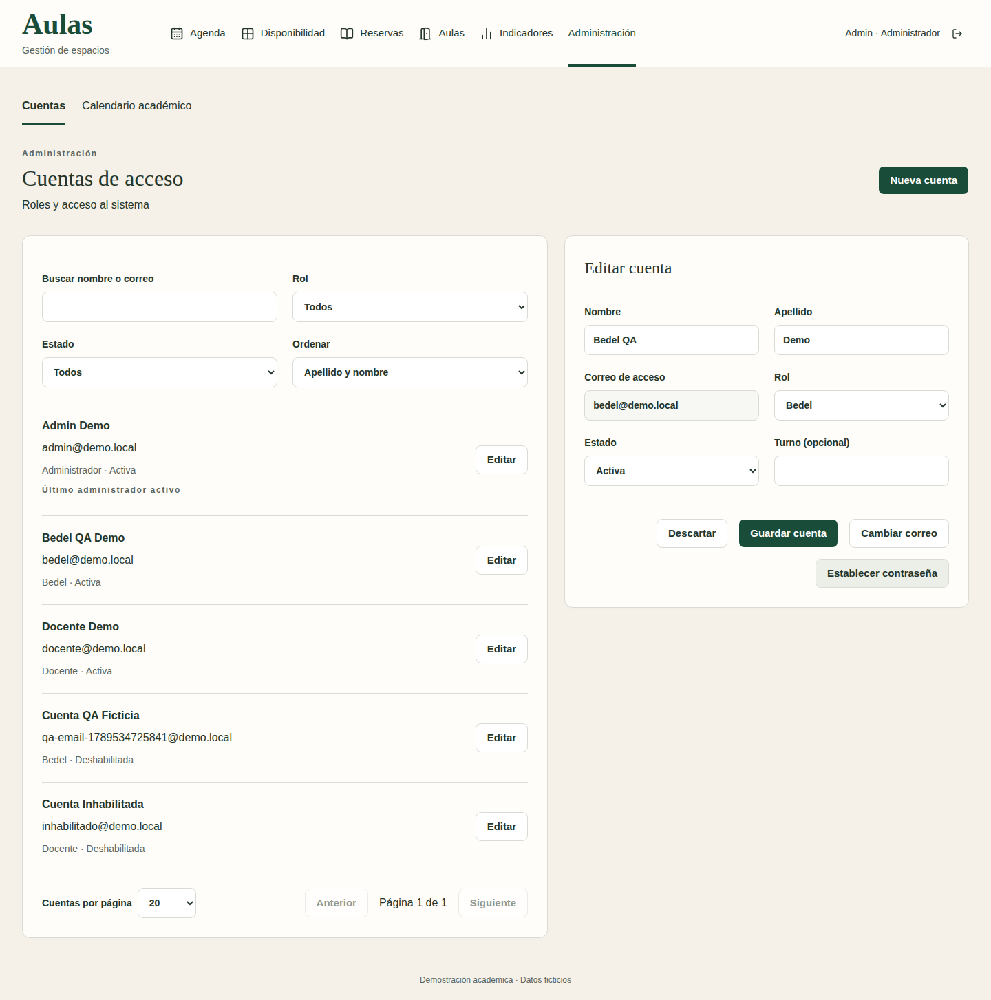
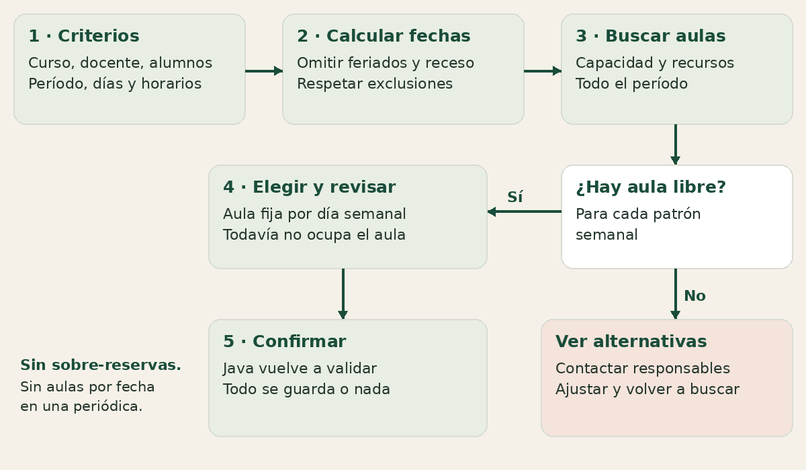
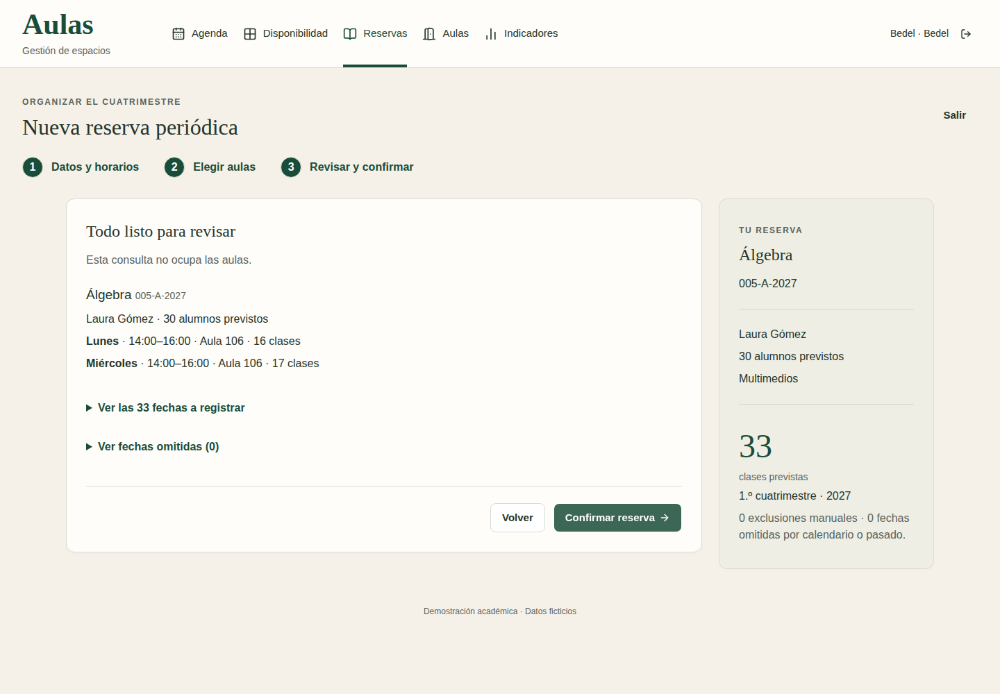
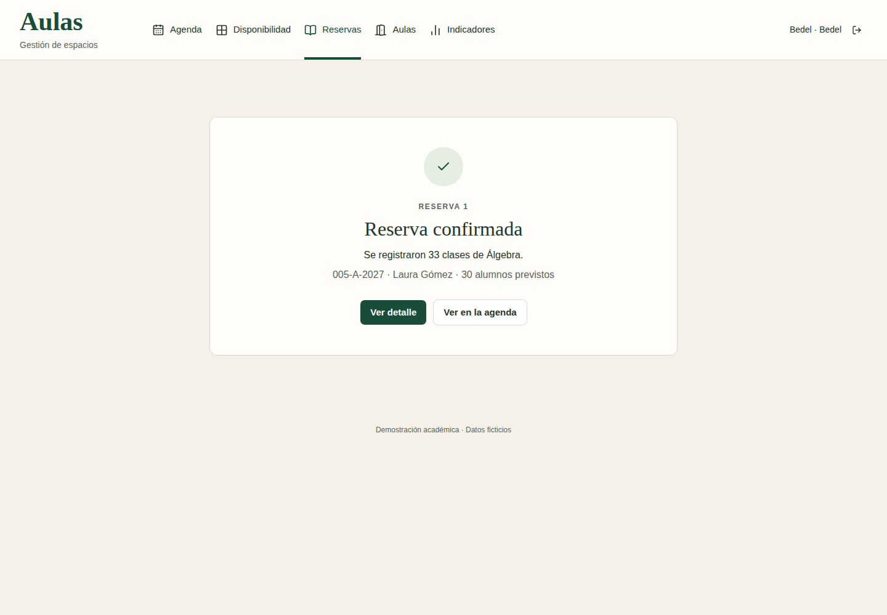
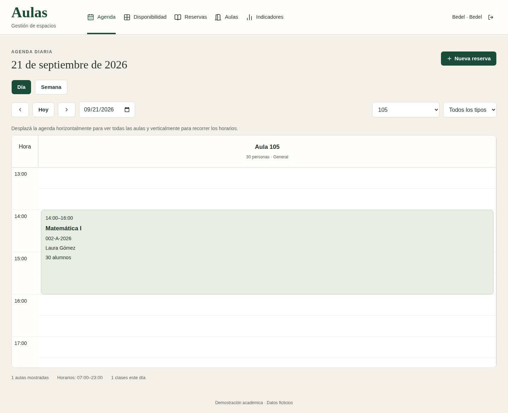
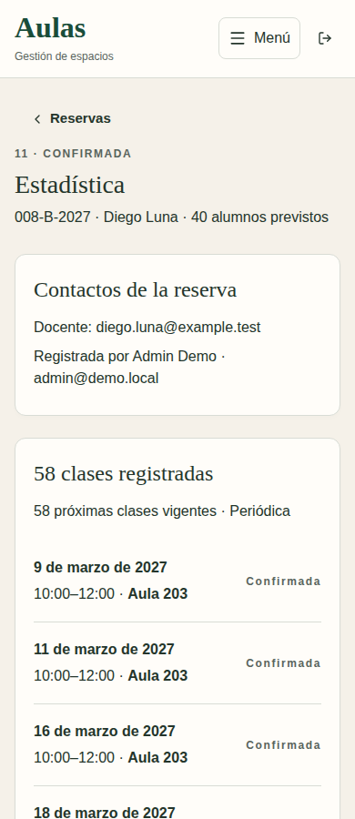
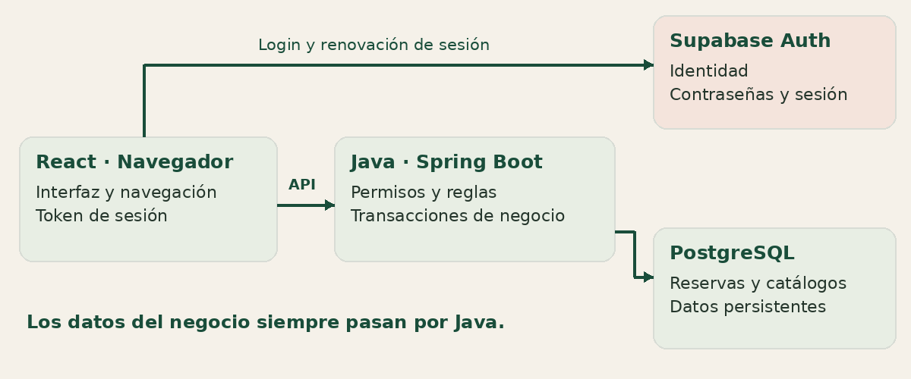
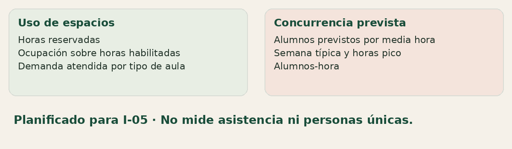

# Aulas · Nos sumamos desde acá

Guía de incorporación al Seminario Integrador · 17 de septiembre de 2026

Para quienes participaron de la definición original y vuelven al proyecto. Lectura estimada: 15–20 minutos. Estado de referencia: cierre de I-03, con QA aprobado. [Descargar la versión PDF](aulas-guia-equipo.pdf).

## 1. Dónde estamos hoy

La idea que definimos juntos ya tiene especificación completa, diseño de pantallas, un prototipo navegable y una primera parte funcionando con datos persistentes. El objetivo sigue siendo organizar aulas y reservas de una institución, sin superposiciones y considerando alumnos, recursos y calendario.

**Ya podemos realizar un recorrido completo:** ingresar, consultar disponibilidad de todo un período, elegir aula por día semanal, confirmar una reserva periódica y volver a verla desde otra sesión. Las cuentas, las aulas y el calendario también se administran desde la app.



**Tres estados que conviene distinguir:** implementado significa conectado a Java/PostgreSQL y verificado; prototipo significa interacción con datos simulados; planificado significa alcance acordado todavía pendiente de construcción. Una pantalla visible no prueba que su integración esté terminada: los indicadores todavía usan datos del prototipo.

El uso será exclusivamente una **demostración académica con datos ficticios**. No hay reservas productivas ni requisitos de operación avanzada. La app se puede presentar localmente, con internet para conectarse a Supabase; publicarla en la web es una opción posterior, sin proveedor de alojamiento elegido.

## 2. Qué se definió después de los documentos originales

Los documentos de fuentes y sus diagramas se conservaron. A partir de ellos se resolvieron ambigüedades y se completaron las reglas de la versión 1. El registro reúne 85 decisiones, llamadas **DA (decisiones acordadas)**. No hace falta leerlas todas para empezar.

- **Una institución.** No se agregó administración multiinstitución ni gestión académica de inscripciones, actas o exámenes.
- **Curso = materia + comisión + año.** Un código como 001-A-2027 es visible para las personas; la base usa un ID interno separado. Hay referencias mínimas de materias/cursos, no un sistema académico completo.
- **Docente solicitante y cuenta de acceso son cosas distintas.** Una lista fija simula los docentes de otro sistema. No hay integración externa. El administrador crea las cuentas que sí permiten iniciar sesión.
- **Cantidad de alumnos prevista.** Es un dato de la reserva: sirve para exigir un aula con capacidad suficiente y para las futuras métricas. Cantidad de PC es descriptiva; no condiciona la búsqueda de disponibilidad.
- **Calendario explícito.** Lunes a viernes, de 07 a 23, módulos de 30 minutos. Dos cuatrimestres por año; feriados cargados manualmente. Una anual une ambos cuatrimestres y omite el receso.
- **Un aula por día semanal en las periódicas.** Puede ser 105 todos los lunes y 204 todos los miércoles. No se elige un aula distinta para cada fecha de la serie.
- **Conflictos informativos.** Si no hay aula libre para todo el patrón, se muestran las mejores alternativas y sus interferencias. Contactar al responsable no libera el aula ni permite confirmar sobre otra reserva.
- **Acceso simplificado.** Supabase administra contraseñas y sesiones. No hay registro público, recuperación propia ni cambio obligatorio; el administrador puede establecer contraseñas.

**Límite de alcance:** no se agregaron correos automáticos, asistencia real, alumnos únicos, optimización global, filtros por PC ni panel de auditoría. Los indicadores previstos describen uso programado; no personas realmente presentes.

## 3. Quién hace qué y qué administración existe

**Administrador:** además de operar como Bedel, administra cuentas y calendario. **Bedel:** gestiona aulas y reservas y consulta información operativa. **Docente:** consulta; no modifica reservas ni recibe contactos administrativos de otras personas. Java comprueba los permisos, aunque alguien intente llamar a la API directamente.

Hoy están conectados el alta y los cambios de cuentas, su habilitación, aulas con características e historial, años/cuatrimestres/feriados y referencias de cursos. Se protege al último administrador activo y se conservan datos históricos. Dar de baja no significa borrar la historia.



*Captura real de I-02: nombres y cuentas ficticios usados en QA. Ilustra la edición de perfil y los accesos separados a correo y contraseña; no contiene credenciales.*

Las aulas se reservan solo si están habilitadas y cumplen los requisitos. Los cambios administrativos no pueden invalidar clases futuras o en curso. Las protecciones se comprueban también en el servidor.

## 4. Cómo funciona una reserva periódica

**Ejemplo:** una comisión necesita lunes y miércoles de 14 a 16 durante un cuatrimestre. El sistema calcula las fechas concretas, omite feriados/exclusiones y busca aulas que sirvan para todas las clases de cada día semanal.



Consultar o revisar **no ocupa aulas**. Recién al confirmar Java vuelve a comprobar requisitos, calendario y ocupación. Guarda la reserva completa o rechaza el intento; no deja una parte confirmada. Los reintentos de la misma operación evitan duplicados si se perdió la respuesta.

Si ningún aula compatible está libre durante todo el patrón, el orden de alternativas es: primero conflictos solo con esporádicas, por menos fechas y luego minutos; después conflictos con periódicas, por menos minutos periódicos y luego fechas esporádicas. Los contactos aparecen solo para los roles operativos. No se puede elegir una alternativa ocupada para confirmar.

**Vocabulario útil:** reserva es el conjunto; patrón es la regla semanal (día, horario, aula); clase u ocurrencia es cada fecha concreta. Esta separación permite consultar ocupación hoy y, más adelante, actualizar una serie sin perder su historia.

## 5. Del formulario a una reserva guardada

La dirección visual elegida se llama **B — PATIO**: fondos claros, verde para acciones, títulos destacados y formularios legibles. Se construyó primero un prototipo para validar recorridos; luego se conectaron por entregas a datos reales.



*Captura real de preparación en I-03.1. Se ven aulas por día semanal y fechas a registrar. Es una propuesta de prueba, no la reserva confirmada de la imagen siguiente.*



*Captura real de I-03.2. El éxito se muestra después del guardado. Los accesos llevan al detalle y a la agenda. Esta reserva de Álgebra se conserva para QA; su horario es 07–09.*

## 6. Qué van a encontrar al abrir la demo

La carga base preparó **20 aulas y 40 cursos para 2026/2027**. I-03 añadió **12 reservas periódicas con 370 clases**: segundo cuatrimestre 2026, primero 2027 y anuales 2027. Además se conservó una reserva de verificación de 33 clases. Al cerrar I-03 había 13 reservas y 403 clases; el QA puede agregar más registros.



*Matemática I, lunes de 14 a 16. Agenda y detalle consultan la misma reserva persistida; recargar no la elimina.*



*Estadística B 2027: 58 clases registradas. La captura corresponde a Bedel; los contactos no se exponen a Docente.*

La carga es explícita y repetible: no se ejecuta al arrancar ni duplica las series al repetirla. **No hace falta recargar datos para explorar.** Las aulas y reservas adicionales del QA se conservan; por eso las cantidades globales pueden cambiar.

## 7. Cómo está construido

La arquitectura es una aplicación React y un único backend Java organizado por módulos. No hay microservicios ni un servidor Next. Las reglas de negocio tienen su autoridad en Java; React presenta formularios, resultados y validaciones de ayuda.



- **Frontend:** React, TypeScript y Vite; React Router; Tailwind y componentes shadcn/Base UI. Chart.js se usa en la referencia visual de indicadores.
- **Backend:** Java 21, Spring Boot y Spring Security. Persistencia mediante JDBC/JPA, migraciones Flyway, transacciones y restricciones PostgreSQL para proteger la integridad.
- **Supabase Auth:** identidad, contraseña y sesión. El rol y estado vigentes de la app se verifican desde Java.
- **PostgreSQL en Supabase:** guarda el dominio. React no consulta directamente sus tablas. Las claves administrativas quedan solo en el backend.

**En desarrollo se levantan dos procesos:** Vite en 5173 y Java en 8080. PostgreSQL/Auth ya están en la nube; no hay que arrancar una base local. Se necesita internet. Docker Compose para empaquetar la demo es parte del cierre previsto, no un requisito para explorar hoy.

En el repo, frontend/ contiene interfaz y pruebas de navegador; backend/ contiene API, dominio, migraciones y pruebas; docs/ contiene especificación, diseño, contratos y planificación.

## 8. Qué falta construir

El alcance general de las siguientes entregas está acordado. **Sus planes detallados todavía deben definirse y aprobarse antes de implementarlos.** No son funciones ya terminadas por estar documentadas o representadas en el prototipo.

**I-04 · Operación completa.** Reservas esporádicas; edición; cambio de aula; reprogramación; cancelación con motivo; revisión de impacto del calendario y actualización de series. Se preservan historia y clases iniciadas. Las esporádicas podrán cubrir actividades en receso, como finales.

**La transición actual es intencional:** si cambiar el calendario requiere generar nuevas clases, Java rechaza el cambio hasta que I-04 implemente la actualización conjunta. No guarda el calendario dejando incompleta la serie. Tampoco se ofrecen acciones de edición/cancelación sobre el detalle persistido.

**I-05 · Consultas e indicadores.** Completar filtros, listados, impresión e indicadores conectados a la base; ampliar el dataset a miles de clases. Hoy los indicadores siguen usando un conjunto separado del prototipo.



Ejemplo: 30 alumnos previstos durante dos horas representan **60 alumnos-hora**. Si una misma persona participa en otra clase, no sabemos que se repite. Por eso hablaremos de concurrencia prevista y carga programada, nunca de cantidad de personas únicas ni asistencia real.

**I-06 · Demo para presentar.** QA integral, empaquetado con Docker Compose, instrucciones y comandos reproducibles de datos/restablecimiento del entorno demo. El alojamiento web es opcional; no se agregan respaldos ni infraestructura de producción.

## 9. Primer contacto: levantar y recorrer

Requisitos para desarrollo: Git, Node 24/npm 11 y Java 21. Maven viene mediante wrapper. Docker se necesita para las pruebas backend con PostgreSQL desechable, no para iniciar la base remota de la demo.

1. Obtener acceso al repositorio y trabajar sobre feat/integracion. El prototipo anterior permanece en prototype/v1; usarlo solo como referencia.
2. Coordinar la configuración privada de backend/.env y frontend/.env.local a partir de sus ejemplos. Las contraseñas y claves no forman parte de esta guía ni de Git. La configuración ya disponible en la máquina de desarrollo no aparece automáticamente en otra computadora.
3. Desde la raíz, abrir dos terminales y ejecutar:

```bash
# Terminal 1
cd backend
./mvnw spring-boot:run
```

```bash
# Terminal 2
cd frontend
npm ci
npm run dev
```

4. Abrir http://localhost:5173. Cuentas ficticias: bedel@demo.local, admin@demo.local y docente@demo.local. Solicitar la contraseña por separado. Evitar iniciar otro backend si 8080 ya está ocupado.

**Recorrido de diez minutos, sin modificar datos:**

- Como Bedel, ir al 21/09/2026, filtrar aula 105 y abrir Matemática I de 14 a 16.
- Consultar Matemática I del 15/03/2027, aula 105, de 09 a 11. Su serie tiene 32 clases y excluye el 17/03.
- Abrir Estadística B anual 2027: 58 clases, martes/jueves de 10 a 12 en 203.
- En Disponibilidad, elegir primer cuatrimestre 2027, 24 alumnos, Laboratorio, Ventiladores, pizarrón cualquiera y martes 14–16. Con la carga de referencia, Lab 2 tiene 480 minutos de interferencia y Lab1 tiene 1920. Consultar sus conflictos; son alternativas informativas.
- Ingresar como Docente y comparar los permisos y contactos visibles. Como Admin, recorrer Cuentas y Calendario sin guardar cambios.

Estas referencias suponen el calendario original y una consulta anterior a marzo de 2027. La app usa el reloj real institucional: al pasar el tiempo o modificar datos, la disponibilidad cambia legítimamente. Nunca borren datos ajenos para reproducir un ejemplo.

## 10. Cómo seguimos trabajando juntos

El próximo paso es detallar I-04. El método aplicado hasta ahora es: acordar alcance y casos de aceptación, implementar en cortes pequeños, revisar reglas y código, ejecutar pruebas, comprobar las pantallas y cerrar cada corte con documentación y commit. La entrega se acepta después del QA manual; I-01, I-02 e I-03 ya están aceptadas.

En I-03 se registraron 76 pruebas backend, 64 unitarias frontend y 33 recorridos de navegador con respuestas controladas, además de recorridos reales contra Supabase y revisión visual. No equivalen a una prueba de carga ni acreditan todavía los objetivos de rendimiento de la especificación. Las pruebas backend usan PostgreSQL aislado; algunas pruebas reales sí crean datos ficticios de QA y deben ejecutarse conscientemente.

**Propuesta de incorporación:** hacer primero el recorrido anterior, anotar dudas por pantalla y revisar juntos el plan de I-04. Después distribuir cortes con responsable y revisor; esta guía no asigna tareas ni cambia el alcance aprobado.

**Lecturas en orden, solo cuando hagan falta:**

- [Índice de documentación](../README.md): puerta de entrada y jerarquía de fuentes.
- [Especificación resumida](../especificacion/00-especificacion.md): reglas finales. Sus referencias a “sin código” describen el cierre documental original; el avance de integración informa el estado actual.
- [Decisiones acordadas](../especificacion/04-decisiones-acordadas.md): explicación de ajustes respecto de las fuentes. DA significa decisión acordada.
- [Plan general I-01 a I-06](../planificacion/integracion.md): orden y fronteras de entregas.
- [QA de I-03](../planificacion/qa-manual-i-03.md): casos para conocer y verificar lo que funciona.
- [Datos demo I-03](../planificacion/datos-demo-i-03.md): series y recuentos esperados.
- [Backend](../../backend/README.md) y [frontend](../../frontend/README.md): configuración y ejecución detalladas.
- [Diseño B](../diseno/README.md) y [modelo consolidado](../especificacion/13-modelo-consolidado.md): referencia de interfaz y dominio.

**Dónde buscar la verdad:** fuentes/ conserva los documentos originales; especificacion/ reúne las reglas vigentes; diseno/ reúne decisiones visuales y prototipo; planificacion/ informa qué se implementó, verificó y aceptó; api/ contiene contratos técnicos. La especificación define el producto completo, no el porcentaje ya implementado.

Repositorio: https://github.com/gabbce/seminario-integrador (requiere acceso si es privado). Esta guía y el PDF se pueden leer sin conexión; los enlaces de detalle requieren acceso al repo. Las capturas son evidencias de I-02/I-03 con datos ficticios, no imágenes generadas de pantallas futuras. Los diagramas son síntesis explicativas y no reemplazan el DER ni los contratos.
